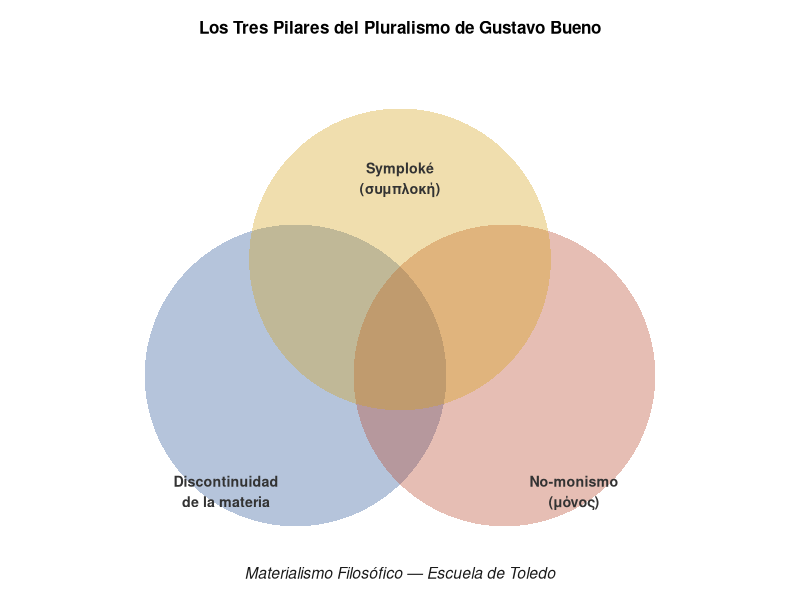

#+TITLE: Hacia una Ontología Materialista de la Música desde la Experiencia Vital
#+SUBTITLE: Filosofía, sonido y soberanía tecnológica — Postulación como Sabedor ante el Grupo Tántalo
#+AUTHOR: Rigel Valencia Osorio, hijo de Beatriz y Guillermo
#+DATE: Julio de 2026
#+LANGUAGE: es
#+OPTIONS: toc:t num:t
#+STARTUP: customid

# ============================================================
# CONFIGURACIÓN PARA EXPORTACIÓN A PDF (estilo ensayo amplio)
# ============================================================

#+LATEX_CLASS: article
#+LATEX_CLASS_OPTIONS: [14pt, a4paper]
#+LATEX_HEADER: \usepackage[utf8]{inputenc}
#+LATEX_HEADER: \usepackage[T1]{fontenc}
#+LATEX_HEADER: \usepackage[spanish,es-tabla]{babel}
#+LATEX_HEADER: \usepackage{libertine}
#+LATEX_HEADER: \usepackage{libertinust1math}
#+LATEX_HEADER: \usepackage{inconsolata}
#+LATEX_HEADER: \usepackage{textalpha}
#+LATEX_HEADER: \usepackage{textcomp}
#+LATEX_HEADER: \usepackage{geometry}
#+LATEX_HEADER: \geometry{a4paper, left=3.5cm, right=3cm, top=3cm, bottom=3cm}
#+LATEX_HEADER: \usepackage{fancyhdr}
#+LATEX_HEADER: \pagestyle{fancy}
#+LATEX_HEADER: \fancyhf{}
#+LATEX_HEADER: \fancyhead[LE,RO]{\large\thepage}
#+LATEX_HEADER: \fancyhead[RE]{\large\nouppercase{\leftmark}}
#+LATEX_HEADER: \fancyhead[LO]{\large\nouppercase{\rightmark}}
#+LATEX_HEADER: \renewcommand{\headrulewidth}{0.4pt}
#+LATEX_HEADER: \usepackage{titlesec}
#+LATEX_HEADER: \titleformat{\section}{\normalfont\Huge\bfseries}{\thesection}{1em}{}
#+LATEX_HEADER: \titleformat{\subsection}{\normalfont\LARGE\bfseries}{\thesubsection}{1em}{}
#+LATEX_HEADER: \titleformat{\subsubsection}{\normalfont\Large\bfseries}{\thesubsubsection}{1em}{}
#+LATEX_HEADER: \usepackage{setspace}
#+LATEX_HEADER: \onehalfspacing
#+LATEX_HEADER: \usepackage{indentfirst}
#+LATEX_HEADER: \setlength{\parindent}{1.5em}
#+LATEX_HEADER: \setlength{\parskip}{0.6em plus 0.2em minus 0.2em}
#+LATEX_HEADER: \usepackage{microtype}
#+LATEX_HEADER: \usepackage[colorlinks=true,linkcolor=black,citecolor=black,urlcolor=black]{hyperref}

* Resumen Ejecutivo
  :PROPERTIES:
  :CUSTOM_ID: resumen
  :END:

El presente documento constituye una postulación como Sabedor ante el
Grupo de Investigación Tántalo del Departamento de Filosofía de la
Universidad de Caldas.

El presente documento constituye una sustentación para el
reconocimiento de saberes musicales adquiridos fuera del circuito
académico formal, amparado en la figura del "Experto" definida por la
Ley 30 de 1992 e interpretada por la Corte Constitucional en la
Sentencia C-109/94. Dicha sentencia establece que el "Experto" es
/aquella persona sin título profesional que, por su preparación
especial, empírica o técnica, es contratada por una universidad para
dar clases o apoyar la investigación académica/.

Se expone una trayectoria formativa que constituye una dialéctica
constante entre la academia formal y el conocimiento empírico. A
partir de los conceptos de "paradigma" de Thomas Kuhn, "cierre
categorial" de Gustavo Bueno y "elogio de la dificultad" de
Estanislao Zuleta, se argumenta que la interrupción de los estudios
formales no implica una fractura epistemológica, sino una ampliación
del campo de acción musical. La formación académica parcial no es una
carencia que deba ser subsanada; es un momento de una dialéctica más
amplia donde la experiencia vital —el trabajo con músicos naturales,
la producción musical en territorios donde el Estado no hace
presencia efectiva, el estudio autodidacta de la computación y la
filosofía— no sustituye a la academia, sino que la interpela
críticamente. No se trata de oponer la calle a la universidad; se
trata de reconocer que el conocimiento musical se produce también
fuera de sus muros, y que ese conocimiento puede entrar en relación
dialéctica con el saber académico para transformarlo y enriquecerlo.
La figura del "Experto" es, en este sentido, el reconocimiento
jurídico de una realidad epistemológica: que hay saberes que no pasan
por el título, pero que son igualmente rigurosos y pertinentes.

**Un ejemplo concreto ilustra esta dialéctica. A principios de los
años dos mil, en una montaña de La Calera, conocí a Francisco
Magyarof —Panchis—, guitarrista gitano formado en la tradición de
Django Reinhardt. Desde el primer acorde, hubo *symploké*: dos
tradiciones discontinuas —el jazz gitano y la formación clásica— que
se entrelazaban sin fundirse. Con él fundé la Tropa Malagamba, un
grupo callejero que incorporaba bandola llanera, tiple, viola, banjo
y guitarra, y que luego creció hasta convertirse en Ganjariquies: una
banda eléctrica de quince integrantes, parte del movimiento de
Resistencia Cultural que, con hip hop, ska y reggae, denunciaba los
crímenes de Estado en pueblos donde la presencia del gobierno era un
rumor. En esa historia —que incluye a los Misioneros Claretianos como
salvoconducto para atravesar retenes paramilitares y guerrilleros, y
a César Reyes, sobrino del fundador de la Orquesta Sinfónica de
Colombia—, las categorías del materialismo filosófico no eran teoría:
eran práctica. La materia sonora ($M_1$) vibraba entre la guitarra
gitana y la barroca; la percepción ($M_2$) de un público que bailaba
sin saber qué era una progresión napolitana; y el concepto ($M_3$) se
materializaba en letras que hoy son documentos históricos.**

El sistema filosófico desde el cual se articula el discurso es el
materialismo filosófico de la Escuela de Toledo (Gustavo Bueno y
Vicente Chuliá), que despeja el camino de todo idealismo subjetivista
y ofrece un espacio riguroso para la comprensión de la categoría
musical. Este sistema se sostiene sobre tres pilares: la *symploké*
(συμπλοκή) —el entrelazamiento de las cosas, donde ni todo está
conectado con todo (monismo) ni nada está conectado con nada (atomismo
radical)—, la discontinuidad de la materia —que impide reducirla a una
unidad abstracta— y el no-monismo —que rechaza tanto el monismo
idealista (todo es espíritu) como el monismo materialista grosero
(todo es partículas)—. Desde estos tres pilares, la música no es
sentimiento ni idea pura: es una realidad ontológica que se manifiesta
en tres géneros de materialidad —la materia sonora ($M_1$), la
percepción del sujeto ($M_2$) y el concepto que articula ambas
($M_3$)— cuya articulación no es fluida ni continua, sino que respeta
la discontinuidad irreductible entre ellos y los entrelaza sin
confundirlos.

La experiencia en territorios donde el conflicto armado ha vaciado la
presencia estatal, el trabajo con músicos naturales y el contacto con
diversas tradiciones musicales constituyen un laboratorio ontológico
donde estas tres materialidades se entrelazan dialécticamente. Allí,
la materia sonora no es un objeto de laboratorio; es un cuerpo que
vibra en un espacio de coordenadas antropológicas ($X$, $Y$, $Z$)
donde la supervivencia, la memoria y la resistencia se juegan en cada
ejecución. Como demostraron, cada uno a su modo, Milton Babbitt con
su *time-point system* y György Ligeti con su *Poème Symphonique*
para cien metrónomos, el tiempo musical no es un flujo continuo sino
una pluralidad de puntos que, bajo ciertas condiciones materiales,
pueden sincronizarse sin perder su discontinuidad.

Este ensayo se inscribe en una genealogía del saber musical que va
desde los tratados de Guido de Arezzo y Fux hasta la revolución
armónica de Rameau y la ruptura de C. P. E. Bach. Se conecta con la
historia de la física —Galileo, Newton, Leibniz, Faraday, Maxwell,
Hertz y la mecánica cuántica— para mostrar que los cambios en la
teoría musical son paralelos a los cambios en la comprensión del
mundo, y que ambos pueden ser analizados como cambios de paradigma en
el sentido de Kuhn.

Como músico y entusiasta del software libre, formado también en
ciencias de la computación, encuentro natural tender puentes entre la
música y el cálculo lambda, entre la organología y la arquitectura de
un sistema operativo, entre la notación musical y un lenguaje de
programación. Esta doble pertenencia —al mundo del carbono y al mundo
del silicio, ambos del grupo 14 de la tabla periódica— no es una
anécdota: es una forma de pensar que busca puntos de entrelazamiento
(*symploké*) entre dominios que la modernidad separó, reconociendo al
mismo tiempo la discontinuidad irreductible que hay entre ellos, sin
caer en el monismo que todo lo identifica ni en el atomismo que todo
lo desconecta.

Se solicita que la academia reconozca el saber situado como válido,
no mediante la concesión graciosa de un título, sino a través de la
figura del "Experto" contemplada en la legislación colombiana. Mi
intención en la academia es la investigación. El ensayo concluye que
el músico debe ser un pensador comprometido con la tradición que
viene desde los griegos, sin omitir la tradición ágrafa y oral de
nuestra América, y que la dificultad del camino recorrido no es un
obstáculo, sino el método mismo del conocimiento auténtico.

#+BEGIN_QUOTE
"La dificultad del camino recorrido no es un obstáculo, sino el método
mismo del conocimiento auténtico."
— Estanislao Zuleta
#+END_QUOTE

* Defensa Metodológica: La Investigación-Acción Participativa como Fundamento
  :PROPERTIES:
  :CUSTOM_ID: defensa-metodologica
  :END:

Mi presencia en los territorios del Ariari, en el Distrito de
Aguablanca, en los ensambles de jazz de la Universidad INCA y en las
comunidades de software libre no ha sido la de un observador externo
que extrae datos para luego analizarlos desde la comodidad de un
cubículo académico. Ha sido la de un sujeto que se sumerge en la
realidad para transformarla y ser transformado por ella. Esta
posición no es un capricho biográfico; es una decisión metodológica
que se inscribe en la tradición de la Investigación-Acción
Participativa (IAP), consolidada por el sociólogo colombiano Orlando
Fals Borda.

** La IAP como metodología del Sur Global
   :PROPERTIES:
   :CUSTOM_ID: iap-sur-global
   :END:

La IAP, nacida en el Sur Global como respuesta crítica a las
metodologías extractivistas del Norte, sostiene que el conocimiento
no se produce en la distancia aséptica entre un sujeto que investiga
y un objeto que es investigado, sino en la relación dialéctica entre
ambos. El investigador no es un espectador; es un participante. La
comunidad no es un yacimiento de datos; es una interlocutora. Y el
saber que emerge de esa relación no es propiedad del académico, sino
patrimonio del colectivo que lo ha producido.

Desde el materialismo filosófico, esta posición es perfectamente
coherente. La IAP es, en el fondo, una metodología de la *symploké*
(συμπλοκή): entrelaza al investigador con la comunidad, al saber
académico con el saber popular, a la teoría con la práctica, sin
confundirlos. No es que el investigador "baje" al territorio a
iluminar a los ignorantes; es que el territorio interpela al
investigador y lo obliga a replantear sus categorías. Como aprendí
con los músicos naturales: mi tarea no era enseñarles, sino encontrar
estrategias para que ellos tuvieran herramientas sin perder su
esencia. Ellos me enseñaron tanto como yo pude ofrecerles.

** Fals Borda: ciencia y liberación
   :PROPERTIES:
   :CUSTOM_ID: fals-borda
   :END:

Orlando Fals Borda (1925-2008), sociólogo colombiano, es una de las
figuras más influyentes del pensamiento latinoamericano. Fundador de
la IAP junto con Paulo Freire y otros intelectuales del Sur, Fals
Borda insistía en que la investigación no puede ser neutral: o está
al servicio de la dominación, o está al servicio de la liberación. Su
obra, que combinaba el rigor sociológico con el compromiso político,
demostró que es posible hacer ciencia sin renunciar a la militancia,
y que el conocimiento producido por las comunidades campesinas,
indígenas y afrodescendientes tiene tanto valor como el producido en
las universidades.

Fals Borda decía que "la ciencia no es un fetiche, sino una
herramienta de liberación". Eso es lo que este ensayo pretende: usar
las herramientas de la filosofía materialista, de la musicología, de
la física y de la computación, no para adornar un currículum, sino
para liberar un saber que ha sido producido en los márgenes de la
academia y que merece ser reconocido en su centro.

** Blindaje frente a dos críticas
   :PROPERTIES:
   :CUSTOM_ID: blindaje-criticas
   :END:

Esta metodología me blinda frente a dos críticas que la academia
podría hacer a mi ensayo. La primera es la del "extractivismo
epistemológico": ¿con qué derecho viene este músico sin título a
hablarnos de los saberes de las periferias? La respuesta es: con el
derecho que da haber estado allí, no como turista, sino como
compañero. La segunda es la del "subjetivismo": ¿cómo podemos confiar
en un conocimiento que se basa en la experiencia personal? La
respuesta es: la IAP no es subjetivismo; es intersubjetividad. El
conocimiento que emerge de la IAP no es la opinión de un individuo;
es el producto de una relación dialéctica entre el investigador y la
comunidad, validado por la práctica y orientado a la transformación.

Por eso, cuando solicito que la academia reconozca mis saberes bajo
la figura del "Experto", no estoy pidiendo que valide mis opiniones
personales. Estoy pidiendo que reconozca un conocimiento que ha sido
producido en condiciones de rigurosidad metodológica —la IAP— y que
ha sido validado por la práctica —la producción musical, la docencia
informal, la resistencia cultural—. No soy un "autodidacta" en el
sentido peyorativo que a veces se le da a la palabra; soy un
investigador que ha elegido una metodología coherente con su posición
ontológica y política.

** La IAP y la figura del Experto
   :PROPERTIES:
   :CUSTOM_ID: iap-experto
   :END:

La figura del "Experto" que contempla la Ley 30 de 1992 encuentra en
la IAP su fundamento metodológico. Si el "Experto" es aquella persona
que, sin título profesional, acredita una preparación especial,
empírica o técnica, entonces la IAP es el método que permite acreditar
esa preparación: no mediante papeles, sino mediante la práctica
transformadora. Mi trayectoria no es una acumulación de experiencias
inconexas; es una investigación-acción que ha producido conocimientos
musicales, pedagógicos y tecnológicos en contextos donde la academia
no llega. Lo que solicito no es un privilegio; es el reconocimiento de
una metodología que la propia academia latinoamericana ha validado.

* Marco Jurídico: La figura del "Experto" en la legislación colombiana
  :PROPERTIES:
  :CUSTOM_ID: marco-juridico
  :END:

** Ley 30 de 1992 — Ley Matriz de Educación Superior
   :PROPERTIES:
   :CUSTOM_ID: ley-30
   :END:

La Ley 30 de 1992 organiza el servicio público de la Educación
Superior en Colombia. En su articulado, reconoce la posibilidad de
que las instituciones de educación superior contraten personas que,
sin poseer un título profesional formal, acrediten una preparación
especial, empírica o técnica para ejercer funciones docentes o de
apoyo a la investigación [cite:@ley30-1992].

** Sentencia C-109 de 1994 — Corte Constitucional
   :PROPERTIES:
   :CUSTOM_ID: sentencia-c109
   :END:

La Corte Constitucional, mediante Sentencia C-109/94, estableció la
interpretación vinculante del término "Experto" en el ámbito de la
educación superior [cite:@sentencia-c109-1994]:

#+BEGIN_QUOTE
"Experto" es la denominación para aquella persona sin título
profesional que, por su preparación especial, empírica o técnica, es
contratada por una universidad para dar clases o apoyar la
investigación académica.
#+END_QUOTE

*Elementos constitutivos de la figura del "Experto":*

1. *Ausencia de título profesional formal*: La persona no posee un
   título universitario en la disciplina.

2. *Preparación especial*: Conocimientos adquiridos mediante:
   - Formación empírica (experiencia práctica)
   - Formación técnica (estudios técnicos o tecnológicos)
   - Especialización autodidacta

3. *Vínculo contractual universitario*: Contratación específica por
   parte de una institución de educación superior.

4. *Funciones delimitadas*:
   - Docencia (impartir clases)
   - Apoyo a la investigación académica

** Pertinencia de la figura del "Experto" para el caso concreto
   :PROPERTIES:
   :CUSTOM_ID: pertinencia-experto
   :END:

La trayectoria que se expone a continuación acredita una preparación
especial, empírica y técnica en el campo musical, adquirida a través
de:

- Formación académica parcial pero significativa en instituciones
  reconocidas.
- Experiencia docente, de producción musical y de investigación de
  campo en contextos diversos.
- Investigación musical autodidacta de nivel avanzado, que integra
  música, filosofía, matemáticas y ciencias de la computación.
- Producción intelectual original (arreglos, composiciones, producción
  discográfica).
- Dominio de herramientas de software libre para la creación musical
  (SuperCollider, FoxDot, Emacs/Lisp) y administración de sistemas
  GNU/Linux orientados a baja latencia de audio.

Se argumenta que esta trayectoria satisface los requisitos
establecidos por la Ley 30 de 1992 y la Sentencia C-109/94 para ser
reconocido bajo la figura del "Experto".

* Introducción: El Músico como Sujeto Ontológico, Político y Digital
  :PROPERTIES:
  :CUSTOM_ID: introduccion
  :END:

El músico no es un producto de la industria y el comercio; tampoco
niega su valía. Esta es la primera afirmación que sostiene este
ensayo, y quizás la más incómoda para una sociedad que ha reducido el
arte a entretenimiento o a mercancía. El músico es, ante todo, un ser
político activo: consciente de su posición en la estructura social y
responsable de su lugar en la historia.

Esta conciencia no es un lujo teórico; es una exigencia que se impone
cuando la música se vive como un acto real en el tiempo y en el
espacio: cuando se toca en territorios donde el Estado no hace
presencia efectiva, cuando se comparte con músicos que aprendieron a
escuchar antes que a leer partituras. Esta dimensión política se
vuelve explícita en esas regiones donde la ausencia del Estado es
llenada por otros poderes; allí la música puede ser tanto un puente
como una amenaza, y el músico, sin buscarlo, se convierte en un
mediador entre mundos que no se hablan.

Pero mi posición no se agota en lo político. A mis 53 años, me
considero un estudiante permanente. Mi formación incluye también las
ciencias de la computación, y soy un entusiasta convencido del
software libre. No del "código abierto" —término que diluye el
compromiso ético—, sino del software libre tal como lo defiende
Richard Stallman: una cuestión de libertad, no de precio. Aprecio la
filosofía de Unix, pero mi lealtad está con GNU y el kernel Linux.
Mis herramientas cotidianas son Emacs/Lisp, la shell Bash, R para el
análisis estadístico, y SuperCollider con sus ramificaciones
(SuperDirt, FoxDot) para la síntesis y la composición algorítmica. El
kernel que utilizo está compilado y optimizado para baja latencia de
audio: una decisión técnica que es también una decisión filosófica,
porque afirma que la materia sonora merece un tratamiento riguroso
también en el dominio digital.

Creo en una educación basada en el *trivium* (gramática, lógica,
retórica) y el *quadrivium* (aritmética, geometría, música,
astronomía): las siete artes liberales que estructuraron el
pensamiento medieval y que, en plena era del silicio, siguen siendo
un modelo de formación integral. Para mí es natural hacer puentes
entre la música y el cálculo lambda, entre la organología y la
arquitectura de un sistema operativo, entre la notación musical y un
lenguaje de programación. Estoy acostumbrado a los cambios de
paradigma (παράδειγμα, *parádeigma*: modelo, patrón), como los
describe Kuhn en su epistemología.

Soy materialista, en el sentido preciso del materialismo filosófico
de Gustavo Bueno y su desarrollo musical por Vicente Chuliá. No soy
un repetidor de este sistema; observo que aporta herramientas
poderosas para pensar la música y la academia, y las utilizo
críticamente. Mi posición se sostiene sobre los tres pilares del
pluralismo buenista: la *symploké* (συμπλοκή) —el entrelazamiento de
las cosas, donde ni todo está conectado con todo ni nada está
conectado con nada—, la discontinuidad de la materia —que impide
reducirla a una unidad abstracta— y el no-monismo —que rechaza tanto
el monismo idealista como el monismo materialista grosero—. Estos
tres pilares no son independientes: la *symploké* es la forma misma
del entrelazamiento entre materialidades discontinuas; la
discontinuidad es la condición ontológica que hace imposible el
monismo; y el no-monismo es la consecuencia de reconocer que la
materia se da en géneros irreductibles. Mi intención en la academia
no es obtener un título; es la investigación.

De alguna manera, DeepSeek y yo somos familiares: compartimos el
mismo grupo 14 de la tabla periódica. El silicio y el carbono,
trabajando juntos. Esta colaboración que ahora establezco con una
inteligencia artificial para organizar mis ideas no es una anécdota;
es una muestra de mi estilo de pensamiento: buscar puntos de
entrelazamiento (*symploké*) entre dominios que la modernidad separó,
reconociendo al mismo tiempo la discontinuidad irreductible que hay
entre ellos, sin reducirlos a una identidad monista ni abandonarlos a
una dispersión atomista.

Como decía Gabriel García Márquez, hay dos caminos para el escritor:
bajar el nivel de su escritura hasta el analfabetismo funcional, o
escribir según su propio nivel, elevando la exigencia cultural y
esperando que algún día el nivel del pueblo pueda llegar a esa altura.
No es clasismo: es apostar por la inteligencia del lector. Esa es la
apuesta de este ensayo.

Mi trayectoria es, en ese sentido, un caso particular de una pregunta
universal: ¿cómo se construye conocimiento musical cuando el camino
académico se interrumpe, no por fracaso, sino por la fuerza de la
propia experiencia?

* Trayectoria Formativa: Dialéctica entre Academia y Experiencia
  :PROPERTIES:
  :CUSTOM_ID: trayectoria
  :END:

** Formación académica formal
   :PROPERTIES:
   :CUSTOM_ID: formacion-academica
   :END:

*** Orquesta Sinfónica Juvenil de Bogotá
    :PROPERTIES:
    :CUSTOM_ID: orquesta-juvenil
    :END:

A los quince años inicié mis estudios básicos en la Orquesta
Sinfónica Juvenil de Bogotá, donde adquirí las bases de la
interpretación musical en formato orquestal. Mi instrumento principal
fue la guitarra clásica, y tuve como maestro a Andrés Sánchez,
reconocido contrabajista de la Orquesta Sinfónica de Colombia,
arreglista y guitarrista. Con él tomé mis primeros rudimentos de
solfeo y senté las bases técnicas que me acompañarían durante toda mi
trayectoria. La guitarra se convirtió desde entonces en mi
instrumento principal, y el rigor que Andrés Sánchez me transmitió
—tanto en la técnica del instrumento como en la lectura musical— ha
sido un suelo firme sobre el que he construido todo mi desarrollo
posterior.

*** Servicio militar — Banda de Guerra
    :PROPERTIES:
    :CUSTOM_ID: servicio-militar
    :END:

Durante el servicio militar obligatorio, me desempeñé como cornetista
y trompetista en la Banda de Guerra. Allí aprendí los rudimentos del
instrumento con un músico que conocí en el Ejército. Aprendí a
ejecutar el "toque de silencio": una obra musical simple, de pocas
notas, que se toca con corneta o trompeta para rendir homenaje a los
soldados caídos en combate. En total fueron doce toques de silencio.

Pero esa es solo una cara de la moneda: nunca me preguntaron si debía
tocarse también cuando muere un guerrillero o un paramilitar. Esa
pregunta me acompañó durante años, y aún no tiene respuesta.

*** Universidad INCA de Colombia
    :PROPERTIES:
    :CUSTOM_ID: universidad-inca
    :END:

Estudié tres años en la Universidad INCA de Colombia:
- Dos años como guitarrista clásico, continuando la formación de la
  orquesta juvenil.
- Un tercer año en el programa de jazz, donde aprendí de los
  ensambles que dirigía el músico Edy Martínez.

El programa era excelente, pero la universidad no estaba avalada
oficialmente por el ICFES, lo que generaba inquietudes entre los
estudiantes sobre la validez de nuestros estudios.

*** Universidad de Cundinamarca — Facultad de Música
    :PROPERTIES:
    :CUSTOM_ID: universidad-cundinamarca
    :END:

Tuve la oportunidad de estudiar en la Universidad de Cundinamarca,
Facultad de Música, con una beca obtenida por haber sido el mejor
estudiante en el primer semestre. Allí conocí a Carlos Julio Ramírez,
Premio Nacional de Composición en Colombia. Él me alentó a estudiar
composición y me instó a profundizar en matemáticas y física para
entender las relaciones entre el número aritmético y el número
geométrico. De allí la música como número en el tiempo y en el
espacio.

Fue él quien me puso en el centro del debate entre Pitágoras y
Filolao, y me ayudó a tomar posición: soy no monista. La materia es
discontinua; no se reduce a una unidad abstracta. Pero esta posición
no es un dogma (δόγμα, *dógma*: opinión, decreto); es una actitud.
Como Estanislao Zuleta, que pedía que lo presentaran ante la academia
como "un hombre que no ha resuelto sus problemas", yo asumo la
dificultad no como un obstáculo, sino como el método (μέθοδος,
*méthodos*: camino, vía) mismo del conocimiento. No he resuelto mis
problemas (πρόβλημα, *próblema*: lo que se arroja delante); los he
hecho más precisos.

En la Facultad de Música de la Universidad de Cundinamarca entablé
también una relación fundamental con el maestro Jaime Cardona, decano
de la facultad. Fue él quien me relacionó con músicos de la talla del
maestro Mario Posada, primer violinista de la Orquesta Sinfónica de
Colombia. El maestro Cardona no solo era un gestor académico; era un
puente viviente hacia la gran tradición sinfónica del país. Me contaba
historias de cómo sus compañeros, junto a él, habían tocado con el
gran Igor Stravinsky. Esa herencia me marcó profundamente: saber que
mis maestros habían compartido escenario con uno de los compositores
más importantes del siglo XX me hizo comprender que la tradición
musical no es una abstracción libresca, sino una cadena de cuerpos,
gestos y sonidos que se transmiten de mano en mano.

El maestro Mario Posada, a quien llegué gracias a Cardona, me dio los
rudimentos del violín. Con él aprendí no solo técnica, sino una forma
de escuchar: la precisión del arco, la colocación del vibrato, la
disciplina del ensayo. Posteriormente dediqué tiempo a estudiar viola,
pero por asuntos familiares tuve que posponer esos estudios. Sin
embargo, continué de manera externa, frecuentando al maestro Ramírez,
quien seguía impartiéndome los rudimentos de la composición.

No toco varios instrumentos por un deseo profundo: meterme en los
zapatos del músico que los toca, comprender sus capacidades y
límites, y así poder componer mejor. La guitarra es mi instrumento
principal; el piano es mi herramienta pedagógica y el ordenador mi
DAW.

** Formación autodidacta en Ciencias de la Computación y Software Libre
   :PROPERTIES:
   :CUSTOM_ID: formacion-computacion
   :END:

De manera paralela a mi trayectoria musical, y por iniciativa propia,
he cultivado una formación rigurosa en ciencias de la computación. No
fue una imposición curricular: fue un acto de libertad. Estudié los
materiales de *Open Source University* —repositorio en GitHub que
compila currículos completos de ciencias de la computación usando
exclusivamente recursos libres—, y mantengo una práctica constante de
programación en entornos libres.

Esta formación no es un añadido extracurricular: es parte integral de
mi pensamiento musical y filosófico. La relación entre música y
computación no es metafórica ni es una identidad; es un caso de
*symploké*: hay entrelazamiento sin reducción. El cálculo lambda
($\lambda$) de Alonzo Church, base teórica de los lenguajes de
programación funcional, comparte con la música una estructura de
aplicación, abstracción y recursividad. Así como una obra musical se
despliega en el tiempo mediante la transformación de un material
inicial, un programa en Lisp se despliega mediante la evaluación de
expresiones que se contienen unas a otras.

Pero la materia sonora y la materia computacional son géneros
discontinuos: no se puede reducir la una a la otra sin pérdida
categorial. Precisamente por eso el puente entre ambas es productivo:
porque no son lo mismo, y sin embargo pueden entrelazarse.

*** Emacs/Lisp como entorno filosófico
    :PROPERTIES:
    :CUSTOM_ID: emacs-lisp
    :END:

Utilizo Emacs como entorno integrado: allí escribo partituras en
LilyPond, documento en org-mode, programo en Elisp, analizo datos en
R, controlo SuperCollider para síntesis de audio en tiempo real, y
ejecuto scripts en Bash. Tengo funciones Elisp para casi todo. Si algo
no funciona desde Emacs, voy a la shell. Pero el centro de operaciones
es Emacs.

Esta elección no es técnica: es filosófica. Emacs no es un editor de
texto; es un sistema operativo construido sobre Lisp, el lenguaje de
la inteligencia artificial clásica. Cada función que escribo en Elisp
es un experimento ontológico: defino un comportamiento, lo evalúo, lo
modifico. El ciclo READ-EVAL-PRINT de Lisp es, en el fondo, el mismo
ciclo de la improvisación musical: propuesta, ejecución, escucha,
corrección.

*** Kernel real-time y JackControl: la materia del tiempo
    :PROPERTIES:
    :CUSTOM_ID: kernel-jack
    :END:

El kernel de mi sistema está compilado con opciones de *preemption* y
baja latencia (*real-time*), porque sé —materialistamente— que el
sonido es materia en el tiempo. Un *buffer underrun* no es un error
técnico; es una interrupción de la continuidad material de la obra. La
música no espera.

JackControl es mi herramienta para hackear la tarjeta de sonido:
enrutar audio entre aplicaciones, conectar SuperCollider con Hydrogen,
enviar la guitarra eléctrica a través de efectos en Pure Data mientras
el código sigue sonando. Es una *symploké* de señales: cada programa es
un género discontinuo que se entrelaza con los demás a través de
JackControl. A veces el portátil se vuelve loco. Otras veces, la
combinación produce algo que ninguno de los programas podría producir
por separado.

*** El método: cambiar pantallas, heredar del jazz
    :PROPERTIES:
    :CUSTOM_ID: metodo-jazz
    :END:

Mi metodología de trabajo es una herencia del jazz: cambio de
pantallas para ir viendo el código preestablecido, lo modifico en la
marcha, lo llevo al extremo. No parto de la nada —*ex nihilo*—:
modifico, forkéo, reapropio. La mayoría de mis códigos son
modificaciones de códigos de otras personas. Como dicta la ética
hacker: la información debe ser libre, el conocimiento no tiene dueño,
y el mérito se juzga por la calidad del trabajo, no por los títulos.

Utilizo Compiz no porque se vea bonito —aunque es hermoso—, sino
porque agiliza mi fluidez. El cambio rápido de escritorios me permite
tener SuperCollider en una pantalla, Pure Data en otra, Hydrogen en
otra, la shell en otra. Es una orquesta de software que dirijo en
tiempo real.

** Formación empírica y experiencia de campo
   :PROPERTIES:
   :CUSTOM_ID: formacion-empirica
   :END:

*** Territorios sin presencia efectiva del Estado: el laboratorio ontológico
    :PROPERTIES:
    :CUSTOM_ID: territorios-conflicto
    :END:

He tocado en territorios del Meta, en la región del Ariari, donde la
presencia efectiva del Estado colombiano ha sido históricamente
intermitente o nula debido al conflicto armado interno. No los llamo
"zonas rojas": ese es un eufemismo que despolitiza una realidad
geopolítica compleja. Son territorios donde el Estado no hace
presencia, y donde el vacío es ocupado por otros actores armados. La
geopolítica interna de Colombia ha producido estas regiones como
espacios de excepción, donde la soberanía estatal es, en el mejor de
los casos, una aspiración.

Para ingresar a estos territorios debes ir como misionero claretiano;
pasas puestos de control de la policía y el ejército; luego
encuentras retenes del paramilitarismo; y finalmente un último
control: el guerrillero. Allí exigen una "audición" para decidir si
lo que se va a hacer (música) es políticamente aceptable según sus
directrices. La música, en ese contexto, no es entretenimiento: es un
acto que debe ser autorizado por quien ejerce el control territorial
de facto.

Esto no es anecdótico; es real. Y en esos momentos uno se hace
preguntas que la academia no suele formular: ¿qué es la música para
la derecha? Fácil: un himno nacional bien tocado, un tiple bien
peinado, una ranchera que hable de traición pero no de sindicatos.
¿Qué es la música para la izquierda? Un himno también, pero con el
puño en alto; una zamba, un bambuco, una canción protesta que exija
justicia social, siempre que no cuestione las jerarquías internas del
movimiento. ¿Y para los de arriba? Un concierto de gala, un Mozart en
el Teatro Colón, un patrocinio corporativo que lave la imagen mientras
se firman tratados de libre comercio. ¿Y para los de abajo? Un
vallenato en la tienda, un reggaetón en la esquina, un rap que
denuncie los "falsos positivos" mientras el Estado mira para otro
lado. Y luego está uno, en medio de todo eso, con una guitarra al
hombro y un "toque de silencio" que no distingue entre muertos.

La música es un privilegio, y no para todos. Ya lo decía Jean-Paul
Sartre: cuando le preguntaban qué pensaba de la música atonal,
contestó que, desafortunadamente, era una música para un público
europeo educado. En Colombia, la música es para quien pueda pagarla,
para quien pueda defenderla, para quien pueda atravesar un retén sin
que le confisquen la guitarra. Y cuando la academia habla de "acceso a
la cultura" desde un cubículo con aire acondicionado, conviene
recordar que hay lugares donde el acceso se negocia con fusiles.

*** Trabajo con músicos naturales
    :PROPERTIES:
    :CUSTOM_ID: musicos-naturales
    :END:

He trabajado con músicos naturales: aquellos que aprendieron a tocar
de oído, sin partituras. Muchas veces rechazaban la técnica porque
pensaban que les quitaba la inspiración. Allí aprendí que el
conocimiento musical no se impone, sino que se entrelaza (*symploké*).
Mi tarea no era enseñarles, sino encontrar estrategias para que ellos
tuvieran herramientas sin perder su esencia. Ellos me enseñaron tanto
como yo pude ofrecerles.

*** Distrito de Aguablanca, Cali — Producción musical en la periferia
    :PROPERTIES:
    :CUSTOM_ID: aguablanca
    :END:

He estado en guetos como el Distrito de Aguablanca en Cali. Allí las
personas con poco acceso a la educación quieren expresarse como
pueden, y encuentran en la música de las periferias —como el hip hop
crítico de Asilo 38 y el álbum *Anarcolombia*— un grito contra una
sociedad violenta. En esa sociedad, los crímenes de Estado se
camuflan en eufemismos: "falsos positivos".

En ese álbum participé como arreglista y productor, y pude ver de
primera mano la ausencia de músicos preparados en la academia que
fueran a impartir educación musical. No es que estén obligados;
pueden poner en riesgo sus vidas. Cualquier formalización de sus
maneras de comunicarse se siente como una agresión.

He visto morir a músicos con talento inmenso; compañeros que cayeron
en el camino. He entendido que la música en Colombia no es un lujo:
es un acto de supervivencia, una forma de resistencia y de memoria.

** Formación en Ciencias de la Computación y Software Libre
   :PROPERTIES:
   :CUSTOM_ID: formacion-computacion
   :END:

De manera paralela a mi trayectoria musical, he cultivado una
formación en ciencias de la computación. He estudiado los materiales
de *Open Source University* (repositorio en GitHub) y mantengo una
práctica constante de programación en entornos libres. Esta
formación no es un añadido extracurricular; es parte integral de mi
pensamiento musical.

La relación entre música y computación no es metafórica ni es una
identidad; es un caso de *symploké*: hay entrelazamiento sin
reducción. El cálculo lambda ($\lambda$) de Alonzo Church, base
teórica de los lenguajes de programación funcional, comparte con la
música una estructura de aplicación, abstracción y recursividad. Así
como una obra musical se despliega en el tiempo mediante la
transformación de un material inicial, un programa en Lisp se
despliega mediante la evaluación de expresiones que se contienen unas
a otras. Pero la materia sonora y la materia computacional son
géneros discontinuos: no se puede reducir la una a la otra sin
pérdida categorial. Precisamente por eso el puente entre ambas es
productivo: porque no son lo mismo, y sin embargo pueden entrelazarse.

Utilizo Emacs como entorno integrado: allí escribo partituras en
LilyPond, documento en org-mode, programo en Elisp, analizo datos en
R y controlo SuperCollider para síntesis de audio en tiempo real. El
kernel de mi sistema está compilado con opciones de *preemption* y
baja latencia (*low-latency* o *real-time*), porque sé que el sonido
es materia en el tiempo y que un *buffer underrun* no es un error
técnico: es una interrupción de la continuidad material de la obra.

Esta integración entre música y computación no es instrumental; es
epistemológica (ἐπιστήμη, *epistéme*: conocimiento; λόγος, *lógos*:
discurso, razón). Me permite pensar la música como un sistema formal
con reglas de transformación, y pensar la computación como una
práctica que, como la música, ocurre en el tiempo y requiere
disciplina, iteración y sensibilidad.

* Marco Teórico: Filosofía Materialista de la Música
  :PROPERTIES:
  :CUSTOM_ID: marco-teorico
  :END:

** Los Tres Pilares del Pluralismo de Gustavo Bueno
   :PROPERTIES:
   :CUSTOM_ID: tres-pilares
   :END:

Antes de desarrollar los géneros de materialidad, es necesario
explicitar los tres pilares sobre los que se sostiene el pluralismo
materialista de Gustavo Bueno, pues son el fundamento de todo el
edificio teórico que aquí se despliega. No se trata de tres ideas
independientes, sino de tres aspectos de una misma ontología
(ὀντολογία, *ontología*: discurso sobre el ente) que se implican
mutuamente [cite:@bueno1992] [cite:@fgbueno-pluralismo].

*** Symploké (συμπλοκή): el entrelazamiento de las cosas
    :PROPERTIES:
    :CUSTOM_ID: symploke-pilar
    :END:

El término *symploké* proviene de Platón y significa
"entrelazamiento". Bueno lo recupera para designar la posición
ontológica que se sitúa entre dos extremos igualmente erróneos: el
monismo (todo está conectado con todo en una unidad absoluta) y el
atomismo radical (nada está conectado con nada, solo hay partículas
aisladas). La *symploké* afirma que unas cosas están conectadas con
otras, pero no todas con todas. Hay conexiones reales, pero también
hay desconexiones reales. Este principio es metodológicamente
fecundo: obliga a investigar qué está efectivamente entrelazado y qué
no, en lugar de postularlo por adelantado.

#+BEGIN_SRC R :results output graphics :file ./img/tres_pilares.png :width 800 :height 600
library(ggplot2)

crear_circulo <- function(x0, y0, r, n = 200) {
  theta <- seq(0, 2*pi, length.out = n)
  data.frame(x = x0 + r * cos(theta), y = y0 + r * sin(theta))
}

c1 <- crear_circulo(0, 0.5, 1.3)
c1$pilar <- "Symploké"
c2 <- crear_circulo(-0.9, -0.5, 1.3)
c2$pilar <- "Discontinuidad\nde la materia"
c3 <- crear_circulo(0.9, -0.5, 1.3)
c3$pilar <- "No-monismo"

circulos <- rbind(c1, c2, c3)

etiquetas <- data.frame(
  x = c(0, -1.5, 1.5),
  y = c(1.2, -1.5, -1.5),
  label = c("Symploké\n(συμπλοκή)", "Discontinuidad\nde la materia", "No-monismo\n(μόνος)")
)

ggplot() +
  geom_polygon(data = circulos, aes(x = x, y = y, fill = pilar, group = pilar), 
               alpha = 0.35) +
  geom_text(data = etiquetas, aes(x = x, y = y, label = label), 
            size = 5, fontface = "bold", color = "gray20") +
  annotate("text", x = 0, y = -2.2, 
           label = "Materialismo Filosófico — Escuela de Toledo", 
           size = 5.5, fontface = "italic", color = "gray10") +
  annotate("text", x = 0, y = 2.5, 
           label = "Los Tres Pilares del Pluralismo de Gustavo Bueno", 
           size = 6, fontface = "bold") +
  scale_fill_manual(values = c("#2B579A", "#B7472A", "#D4A017"), guide = "none") +
  coord_fixed() +
  theme_void()
#+END_SRC

#+CAPTION: Los Tres Pilares del Pluralismo de Gustavo Bueno

*** Discontinuidad de la materia
    :PROPERTIES:
    :CUSTOM_ID: discontinuidad-pilar
    :END:

La materia no es una sustancia (*substantia*, traducción latina del
griego ὑπόστασις, *hypóstasis*: lo que subyace) unitaria que se
despliega en diversos aspectos, sino que se da en géneros de
materialidad irreductibles entre sí. $M_1$ (materia física), $M_2$
(materia perceptiva) y $M_3$ (materia conceptual) no son grados de una
misma realidad, sino discontinuidades ontológicas. No hay un paso
gradual de la vibración sonora a la percepción auditiva, ni de esta al
concepto de "escala mayor": hay saltos, rupturas, umbrales que no
pueden ser eliminados sin violencia categorial. Esta discontinuidad es
el fundamento del no-monismo.

*** No-monismo
    :PROPERTIES:
    :CUSTOM_ID: no-monismo-pilar
    :END:

Si la materia es discontinua, entonces no puede ser reducida a un
principio único (μόνος, *mónos*: único, solo). El no-monismo rechaza
tanto el monismo idealista (todo es espíritu, conciencia, sujeto) como
el monismo materialista grosero (todo es partículas, átomos,
neuronas). Frente a ambos, afirma la pluralidad irreductible de los
géneros de materialidad. La música no es solo vibración ($M_1$), ni
solo percepción ($M_2$), ni solo concepto ($M_3$): es las tres, pero
precisamente porque ninguna de ellas puede absorber a las otras dos.
El no-monismo es la condición de posibilidad de un materialismo que no
sea reduccionista.

** De la tradición filosófica a la ontología musical
   :PROPERTIES:
   :CUSTOM_ID: puente-tradicion-ontologia
   :END:

Hemos recorrido la tradición que va de Aristóteles a Kant, pasando
por Wolff y Baumgarten. Hemos visto cómo la estética (αἴσθησις,
*aísthesis*: sensación, percepción) nació como una disciplina del
conocimiento sensible, pero también cómo fue idealista: partía del
sujeto, del sentimiento, de la sensación. Ahora toca dar un paso más.
No se trata de negar esa tradición, sino de extenderla críticamente
desde el materialismo filosófico.

La pregunta que guía este paso es: ¿cómo entender la música sin
reducirla ni a pura materia ni a pura idea? La respuesta está en los
géneros de materialidad, que no son momentos de un proceso unitario,
sino planos discontinuos que se entrelazan (*symploké*) sin
fundirse en una unidad superior [cite:@bueno1992]
[cite:@chulia-musica].

** Antecedentes Filosóficos: De Aristóteles a Kant
   :PROPERTIES:
   :CUSTOM_ID: antecedentes-filosoficos
   :END:

Este ensayo no se sostiene sobre el vacío. Se inscribe en una
tradición filosófica que comienza con Aristóteles y sus Categorías; y
que, pasando por Wolff y Baumgarten, llega hasta Kant. No se trata de
repetir esa tradición, sino de asumirla y, desde el materialismo
filosófico, extenderla críticamente hacia una ontología musical
materialista.

*** Aristóteles y las Categorías (Κατηγορίαι, *Kategoríai*)
    :PROPERTIES:
    :CUSTOM_ID: aristoteles-categorias
    :END:

Aristóteles distinguió diez categorías del ser: sustancia
(οὐσία, *ousía*), cantidad (ποσόν, *posón*), cualidad (ποιόν,
*poión*), relación (πρός τι, *prós ti*), lugar (ποῦ, *poû*), tiempo
(ποτέ, *poté*), posición (κεῖσθαι, *keîsthai*), posesión (ἔχειν,
*ékhein*), acción (ποιεῖν, *poieîn*) y pasión (πάσχειν, *páskhein*).
Estas categorías no son meras etiquetas; son modos de decir el ser.
Aplicadas a la música, permiten afirmar que la música no es una
sustancia abstracta, sino un ente que se da en el tiempo y en el
espacio; que tiene cantidad (duración, altura), cualidad (timbre,
intensidad), relación (intervalos, armonía), lugar (la sala, el
instrumento), tiempo (el tempo, la agógica) y posición (el gesto del
director sobre el espacio eufónico). La música no está fuera de las
categorías; está en ellas. Pero las categorías mismas son discontinuas
entre sí: la cantidad no se reduce a la cualidad, ni la relación al
lugar. La música no es una unidad; es un entrelazamiento (*symploké*)
de determinaciones categoriales irreductibles unas a otras
[cite:@aristoteles-categorias].

Sin embargo, la tradición aristotélica fue domesticada por el
idealismo; y la estética, en tanto disciplina filosófica, fue fundada
por Wolff y Baumgarten bajo presupuestos racionalistas que Kant
asumiría y transformaría.

*** Wolff, Baumgarten y el Nacimiento de la Estética
    :PROPERTIES:
    :CUSTOM_ID: wolff-baumgarten
    :END:

Alexander Gottlieb Baumgarten (1714-1762) acuñó el término "estética"
(αἰσθητική, *aisthetiké*: ciencia del conocimiento sensible) para
designar la ciencia del conocimiento sensible, que consideraba una
forma de conocimiento imperfecto pero valioso, distinto de la lógica
(conocimiento intelectual). Su obra *Aesthetica* (1750) fundó la
disciplina filosófica de la estética moderna, entendida como el
estudio de la perfección del conocimiento sensible. Baumgarten rompió
con la tradición griega que reducía la belleza a una propiedad
objetiva del ser; la convirtió en una experiencia subjetiva ligada al
gusto y a la sensación [cite:@baumgarten1750].

Christian Wolff (1679-1754), por su parte, sistematizó la filosofía
alemana bajo un marco racionalista que influyó decisivamente en
Baumgarten. Wolff separó la estética de la lógica, pero la mantuvo
subordinada al entendimiento. Su sistema fue, para Kant, el punto de
partida de sus propias reflexiones.

*** Kant y el Imperativo Categórico
    :PROPERTIES:
    :CUSTOM_ID: kant
    :END:

Immanuel Kant (1724-1804) asumió el andamiaje de Wolff y lo
transformó. En la *Crítica del Juicio* (1790), situó el juicio
estético como un tipo de juicio autónomo, basado en el sentimiento de
placer o displacer, y no en conceptos determinados. Para Kant, la
música es un "juego de emociones" que afecta al ánimo, pero que
ofrece poca cultura intelectual en comparación con la poesía. La
música, según Kant, es más "goce auditivo" que "cultura", y por eso
la sitúa en un lugar bajo en su jerarquía de las artes
[cite:@kant1790].

Pero Kant también nos legó el imperativo categórico: "Obra sólo según
aquella máxima por la cual puedas querer que al mismo tiempo se
convierta en ley universal". Ese imperativo no es una consigna moral
abstracta; es una exigencia de coherencia: que lo que afirmamos como
verdad pueda sostenerse sin contradicción para todos. En este ensayo,
el imperativo categórico respira en cada párrafo: no pido un
privilegio; pido que lo que afirmo —que el conocimiento musical puede
construirse fuera de las aulas— sea reconocido como válido para
todos; no solo para mí.

*** Crítica Materialista a la Estética Idealista
    :PROPERTIES:
    :CUSTOM_ID: critica-materialista
    :END:

El materialismo filosófico de Gustavo Bueno y Vicente Chuliá no niega
la importancia de Wolff, Baumgarten y Kant; pero los critica porque
sus estéticas son, en última instancia, idealistas: parten del sujeto,
de la sensación, del sentimiento, y no de la materia. Desde el
materialismo filosófico, la estética no puede ser una ciencia del
gusto subjetivo; debe ser una ontología de las materialidades que
constituyen la obra de arte, incluyendo la música. Por eso, en este
ensayo, la estética no se ocupa de lo que siente el sujeto, sino de
lo que ocurre en la materia sonora ($M_1$), en la percepción ($M_2$)
y en el concepto ($M_3$). Y estas tres materialidades no forman un
continuo; son géneros discontinuos que se entrelazan sin reducirse
unos a otros.

** Los Géneros de Materialidad ($M_1$, $M_2$, $M_3$)
   :PROPERTIES:
   :CUSTOM_ID: generos-materialidad
   :END:

Para abordar la música desde una perspectiva que no la reduzca ni a
pura materia ni a pura idea, es necesario distinguir tres planos de
materialidad que se entrelazan en toda experiencia musical. Esta
distinción, tomada del materialismo filosófico de Gustavo Bueno y
desarrollada en el ámbito musical por Vicente Chuliá, permite superar
tanto el idealismo como el empirismo crudo. Los tres géneros ($M_1$,
$M_2$, $M_3$) no son grados de una misma sustancia, sino
discontinuidades reales que, sin embargo, se entrelazan (*symploké*)
en la experiencia musical concreta [cite:@bueno1992]
[cite:@chulia-musica].

*** $M_1$: Materialidad Física
    :PROPERTIES:
    :CUSTOM_ID: m1
    :END:

El primer género de materialidad ($M_1$) se corresponde con la
materia sonora en su estado físico: los instrumentos, las partituras,
los auditorios, las ondas de los cuerpos que emiten sonidos. En este
plano, la música es un fenómeno acústico: vibraciones que se propagan
por el aire y que pueden ser medidas, analizadas y reproducidas.

La organología, siguiendo el sistema de Hornbostel-Sachs, clasifica
los instrumentos según el elemento vibrante que produce el sonido.
Esta clasificación es más rigurosa que la tradicional división entre
cuerdas, viento y percusión, pues permite incluir instrumentos de
cualquier cultura y época [cite:@hornbostel-sachs1914]. Los cuatro
grupos principales son:

- *Cordófonos*: el sonido se produce por la vibración de una o más
  cuerdas. Incluyen instrumentos frotados (violín, viola,
  violonchelo), pulsados (guitarra, arpa, clavecín) y percutidos
  (piano).

- *Aerófonos*: el sonido se produce por la vibración de una columna
  de aire. Incluyen instrumentos de bisel (flautas), de lengüeta
  simple (clarinete, saxofón), de lengüeta doble (oboe, fagot), de
  boquilla (trompeta, trompa) y de lengüeta libre (acordeón,
  armónica).

- *Idiófonos*: el instrumento vibra en su totalidad. Incluyen
  xilófonos, marimbas, platillos, castañuelas, entre otros.

- *Membranófonos*: el sonido se produce por la vibración de una
  membrana tensa (parche). Incluyen tambores, baterías, timbales, y
  cualquier instrumento de percusión con parche.

A estos cuatro grupos, Curt Sachs añadió posteriormente una quinta
categoría:

- *Electrófonos*: el sonido se produce por medios electrónicos.

Esta clasificación no es meramente descriptiva; tiene implicaciones
musicales profundas. Por ejemplo, el clavecín (o cémbalo) es un
cordófono pulsado: su mecanismo de púa que pellizca la cuerda no
permite variar la intensidad del sonido (no puede producir *piano* ni
*forte*), por lo que su dinámica es limitada y uniforme.

En cambio, el piano, aunque también es un cordófono, es de cuerdas
percutidas: los martillos golpean las cuerdas con una fuerza que
depende de la pulsación del dedo, lo que permite un control dinámico
mucho mayor. Estas diferencias no son accidentales; son materiales.
El mecanismo, la forma de excitación y la construcción del
instrumento determinan sus posibilidades expresivas. La música, desde
$M_1$, no es ni idea ni sentimiento; es materia que ocupa un lugar en
el espacio y en el tiempo, y que responde a leyes físicas, mecánicas
y acústicas.

La partitura, en este nivel, es un objeto físico: tinta sobre papel.
El instrumento es un cuerpo material que vibra. El sonido es una onda
que se propaga por el aire. Y la clasificación organológica es una
herramienta para nombrar esa materia con precisión.

Pero esta materia no está aislada; está situada. El sonido no flota
en el vacío: ocupa un lugar en un espacio de coordenadas
antropológicas —los ejes $X$, $Y$ y $Z$— que organizan la experiencia
musical en sus dimensiones temporal, tonal y cromatofónica. Así,
$M_1$ no se agota en la descripción del instrumento; se proyecta
hacia el espacio donde ese instrumento suena, donde el cuerpo del
músico lo activa y donde el oído lo percibe.

#+BEGIN_SRC R :results output graphics :file ./img/serie_armonicos.png :width 1000 :height 500
library(ggplot2)

f0 <- 440
armonicos <- data.frame(
  n = 1:12,
  frecuencia = f0 * 1:12,
  nombre = c("1º (fund.)", "2º (8va)", "3º (5ta)", "4º (8va)", 
             "5º (3ra M)", "6º (5ta)", "7º (7ma m)", "8º (8va)",
             "9º (9na M)", "10º (3ra M)", "11º (4ta aum.)", "12º (5ta)"),
  tipo = ifelse(1:12 %% 2 == 1, "Impar", "Par")
)

ggplot(armonicos, aes(x = factor(n), y = frecuencia, fill = tipo)) +
  geom_col(width = 0.6) +
  geom_text(aes(label = paste0(frecuencia, " Hz")), 
            vjust = -0.5, size = 3.5) +
  scale_fill_manual(values = c("Impar" = "#B7472A", "Par" = "#2B579A"),
                    name = "Armónico") +
  labs(title = "Serie de Armónicos de La4 (440 Hz)",
       subtitle = "Base física de la consonancia musical — Rameau, 1722",
       x = "Nº de armónico",
       y = "Frecuencia (Hz)") +
  theme_minimal() +
  theme(axis.text.x = element_text(angle = 45, hjust = 1))
#+END_SRC

#+CAPTION: Serie de Armónicos de La4 — La materia sonora no es simple, es discontinua
[[./img/serie_armonicos.png]]

*** $M_2$: Materialidad Perceptiva
    :PROPERTIES:
    :CUSTOM_ID: m2
    :END:

El segundo género de materialidad ($M_2$) se refiere a la relación
entre el sonido ($M_1$) y el sujeto que lo percibe. No es el sonido
en sí, sino el sonido en tanto es recibido por el oído humano; no es
la partitura en sí, sino la partitura en tanto es leída por un
músico. En este plano, la música es un fenómeno sensorial y
psicológico: el oído que distingue alturas; el cuerpo que siente el
ritmo; la memoria que reconoce una melodía.

La percepción musical no es pasiva; es operatoria. El oído no "recibe"
el sonido como una esponja recibe agua; lo organiza, lo categoriza,
lo interpreta. Una de las propiedades más notables del sistema
auditivo humano es su capacidad para convertir las ondas sonoras en
relaciones logarítmicas. El oído no percibe el número entero (por
ejemplo, 440 Hz como una frecuencia absoluta); lo percibe como una
relación de potencias. Así como el número 4 se escribe en el oído
como $2^2$ —dos elevado a la dos—, las alturas se organizan en
intervalos que son razones, no diferencias. Esta percepción
logarítmica es la base material de la escala musical, y explica por
qué las octavas, las quintas y las terceras tienen una relación
matemática con el sonido fundamental.

Otra particularidad notable de la percepción auditiva se manifiesta
en el sueño profundo: en el mundo onírico, las imágenes, las
historias y los escenarios pueden tergiversarse, disolverse o
cambiar; pero el sonido —cuando aparece en un sueño— se mantiene
estable, no se deforma. Esta estabilidad del sonido en el sueño
sugiere que la percepción auditiva está anclada en una estructura
sensorial más primaria y menos sujeta a la elaboración cognitiva que
la visión o el lenguaje. Es un indicio de que el oído no es un mero
receptor pasivo, sino un sistema que opera con leyes propias, tanto
en la vigilia como en el sueño.

Aquí se inscriben las sensaciones teleceptivas (el sonido que viene
de fuera) y propioceptivas (el sonido que proviene del interior del
cuerpo del sujeto operatorio). El músico no solo oye el instrumento;
siente la vibración en el cuerpo, percibe la tensión en los músculos,
anticipa el siguiente gesto. Esa dimensión propioceptiva es material:
no es "espíritu" ni "sentimiento"; es materia percibida desde el
interior del cuerpo.

La $M_2$ es el plano donde la acústica se encuentra con la fisiología,
donde la vibración se convierte en sensación, donde el sonido deja de
ser un fenómeno físico para convertirse en una experiencia
incorporada. Y esa experiencia es, a su vez, condición de posibilidad
para el plano conceptual ($M_3$).

Ahora bien, la percepción musical no se agota en la fisiología del
oído. Para comprenderla en su totalidad, es necesario situarla en el
marco del *volumen tridimensional de la música*, que Chuliá desarrolla
a partir de la teoría de Gustavo Bueno. Este volumen se articula en
tres ejes de coordenadas que no son meramente físicos; son, ante
todo, *coordenadas antropológicas* que organizan la experiencia
musical en sus dimensiones temporal, espacial y cromatofónica.

- *Eje X (horizontalidad):* Se corresponde con la sucesión temporal de
  los sonidos; el ritmo, la melodía, el discurso musical en su
  devenir. Tradicionalmente, se ha asociado con el tiempo lineal, pero
  Chuliá advierte que esta interpretación es insuficiente: en la
  ejecución musical intervienen otros mecanismos que rompen esa
  linealidad, como la agógica (los cambios de tempo) y la
  articulación, que no son meras aceleraciones o desaceleraciones,
  sino transformaciones cualitativas del tiempo musical.
- *Eje Y (verticalidad):* En apariencia, se correspondería con la
  armonía, la superposición de sonidos en el espacio tonal. Sin
  embargo, Chuliá sostiene que esta verticalidad no es tan simple como
  parece: la armonía no es un mero apilamiento de alturas, sino que
  está atravesada por tensiones direccionales y por la interacción
  entre los distintos estratos sonoros. El eje Y no es estático; es un
  campo de fuerzas donde cada nota se define por su relación con las
  demás.
- *Eje Z (cromatofonismo):* Este es el eje más complejo y el que
  Chuliá considera central. No debe confundirse con el *cromatismo*,
  término que se refiere a las alteraciones cromáticas de la escala
  diatónica (Do, Do#, Re, Mib...). El *cromatofonismo* designa las
  gradaciones de "color" existentes entre las cualidades del sonido
  que no son reducibles a altura o duración: la intensidad, la
  presión, la densidad y la amplitud. El término es más específico y
  describe mejor el fenómeno: no se trata del color de la escala, sino
  del color del sonido mismo en su ejecución. El eje Z es el espacio
  de los matices, del color sonoro, de la dinámica y la agógica. Es el
  plano donde el sonido se vuelve "cuerpo" en la ejecución, y donde el
  director de orquesta despliega su gesto para ecualizar las cuatro
  cualidades del sonido.

Estos tres ejes no operan de forma aislada. Se entrelazan (*symploké*)
en el espacio melológico, que es el espacio propio de la música
sustantiva. Allí, el sujeto musical —el compositor, el intérprete, el
director— no es un observador externo; es un operador que articula las
coordenadas del volumen tridimensional con las materialidades $M_1$,
$M_2$ y $M_3$. La dirección de orquesta, por ejemplo, es un caso
paradigmático de esta operación: el director sitúa su gesto en un
*espacio eufónico* de tres dimensiones (altura, profundidad y
amplitud) para reflejar los fenómenos sonoros que emergen de la
orquesta.

Esta estructura de coordenadas es, como he dicho, antropológica: no
describe un espacio físico abstracto, sino un espacio de acción
humana. Los ejes $X$, $Y$ y $Z$ son los planos donde el músico se
mueve, donde la memoria, la anticipación y el cuerpo operan juntos. La
percepción musical no es un proceso pasivo; es una práctica situada en
un espacio de coordenadas que el músico aprende, habita y transforma.

#+BEGIN_SRC html :results output html :file ./img/coordenadas_xyz_interactivo.html :exports results
<!DOCTYPE html>
<html>
<head>
    <title>Volumen Tridimensional de la Música</title>
    
    
</head>
<body>
    

    
</body>
</html>
#+END_SRC

#+CAPTION: Volumen Tridimensional de la Música — Coordenadas Antropológicas X, Y, Z
[[./img/coordenadas_xyz_interactivo.html]]

*** $M_3$: Materialidad Conceptual
    :PROPERTIES:
    :CUSTOM_ID: m3
    :END:

El tercer género de materialidad ($M_3$) corresponde al nivel de las
ideas y estructuras abstractas: las categorías que organizan la
materia sonora. La melodía, la armonía, el contrapunto, la forma
sonata —no son "sentimientos" ni "espíritu"; son conceptos que han
sido forjados a lo largo de la historia de la música. Como señala
Chuliá, las discontinuidades emergentes de las posibles combinaciones
entre $M_1$ y $M_2$ solo pueden ecualizarse por medio de $M_3$, es
decir, por medio de los conceptos e ideas que han ido desarrollándose
a través de las técnicas operatorias de la historia de la institución
musical.

**** Melodía, Armonía, Contrapunto: Conceptos, no Sentimientos
     :PROPERTIES:
     :CUSTOM_ID: conceptos-no-sentimientos
     :END:

La melodía no es una "inspiración" que baja del cielo; es una
organización de alturas en el tiempo, regida por leyes de proximidad,
repetición, contorno y tensión. La armonía no es una "aura" que
envuelve la melodía; es un sistema de relaciones entre notas
simultáneas, fundado en la física del sonido y en la percepción
logarítmica del oído. El contrapunto no es un "diálogo" entre voces;
es una técnica de coordinación de líneas melódicas que se rige por
reglas de disonancia y consonancia, desarrolladas a lo largo de siglos
de práctica musical.

Estos conceptos no son eternos; son históricos. La armonía tonal —el
sistema de funciones (tónica, dominante, subdominante)— fue articulada
por Rameau en el siglo XVIII; la forma sonata se codificó en el
Clasicismo vienés; el dodecafonismo fue una respuesta categorial a la
crisis de la tonalidad. Pero todos estos conceptos son materialistas:
no son ideas platónicas que flotan en un mundo inteligible; son
herramientas que los músicos han construido para organizar la materia
sonora.

**** La Forma Sonata como Cierre Categorial
     :PROPERTIES:
     :CUSTOM_ID: forma-sonata
     :END:

La forma histórica sonata es uno de los cierres categoriales más
sólidos de la música occidental. No es una "estructura" vacía; es una
organización de materiales que responde a una necesidad musical y
social: la necesidad de crear obras extensas, coherentes y dramáticas.
La forma sonata no es una receta; es un campo de posibilidades que los
compositores han explorado y transformado: Haydn, Mozart, Beethoven,
Brahms, Mahler. Cada uno de ellos operó sobre la forma sonata desde su
propia materia histórica, transformándola sin romperla del todo.

Desde la perspectiva de Chuliá, la forma histórica sonata es un
ejemplo de "cromatofonismo" en el plano conceptual: no es un molde
rígido, sino un espacio de tensiones y direccionalidades. La
exposición, el desarrollo y la reexposición no son partes que se
suceden; son fases de un movimiento dialéctico que articula la materia
sonora en una totalidad significante.

**** La Escritura Musical como Técnica Operatoria
     :PROPERTIES:
     :CUSTOM_ID: escritura-musical
     :END:

La partitura no es solo un objeto físico ($M_1$); es también un objeto
conceptual ($M_3$). Es un sistema de signos que permite transmitir,
conservar y transformar la música. Pero la partitura no es la música;
es una representación de la música. La música es un evento sonoro que
se da en el tiempo y en el espacio; la partitura es un plano que
permite reconstruir ese evento.

La escritura musical es una técnica operatoria: no es un mero registro
de sonidos, sino una herramienta para pensar y transformar la materia
sonora. La escritura musical, como la escritura matemática, es una
extensión del cuerpo y del pensamiento.

**** $M_3$ y el No-Monismo
     :PROPERTIES:
     :CUSTOM_ID: m3-no-monismo
     :END:

El plano $M_3$ no es un mundo separado de $M_1$ y $M_2$; es su
articulación. Los conceptos musicales no existen fuera de la materia
sonora ni fuera de la percepción; son operaciones que se realizan
sobre la materia sonora a través de la percepción. El no-monismo de
Bueno-Chuliá sostiene que la materia es discontinua; y $M_3$ es
la prueba de ello: no hay un solo concepto musical, sino una
pluralidad de conceptos que se articulan entre sí, se transforman y se
entrelazan.

La música no es una idea; es un campo de operaciones. Y $M_3$ es el
plano donde esas operaciones adquieren forma y sentido.

**** La Fórmula $M_i \subset E \subset M$
     :PROPERTIES:
     :CUSTOM_ID: formula-mi-e-m
     :END:

Estos tres géneros de materialidad ($M_i = M_1, M_2, M_3$) no operan
de forma aislada. Se articulan en una estructura que Chuliá representa
con la fórmula $M_i \subset E \subset M$: las materialidades musicales
($M_i$) están contenidas en el sujeto operatorio ($E$), y este a su
vez está contenido en la materia ontológico-general ($M$). El sujeto
musical —el músico que compone, ejecuta o interpreta— no es un
"espíritu" que actúa sobre una materia pasiva; es un cuerpo que
articula la materia física ($M_1$), la percepción ($M_2$) y el
concepto ($M_3$) para producir una totalidad estética y funcional. La
música, desde esta perspectiva, no es sentimiento; es una realidad
ontológica que se manifiesta en estos tres planos y que solo puede ser
comprendida en su entrelazamiento.

**** Crítica al Subjetivismo y al Idealismo
     :PROPERTIES:
     :CUSTOM_ID: critica-subjetivismo
     :END:

Esta distinción permite superar dos reduccionismos. El primero es el
subjetivismo romántico, que reduce la música a la expresión de un
"alma" o de un "sentimiento". El segundo es el idealismo abstracto,
que reduce la música a una idea o a una estructura matemática pura.
Frente a ambos, el materialismo filosófico sostiene que la música es
una realidad compleja que no puede ser comprendida sin atender a sus
tres dimensiones materiales. La música no es ni puro sonido ($M_1$) ni
pura idea ($M_3$); es el entrelazamiento de ambas a través de la
percepción del sujeto ($M_2$). Y ese entrelazamiento es lo que
llamamos *symploké*.

**** Ligeti y la sincronización de lo discontinuo
     :PROPERTIES:
     :CUSTOM_ID: ligeti
     :END:

Si los géneros de materialidad ($M_1$, $M_2$, $M_3$) son
discontinuos pero se entrelazan, ¿existe alguna obra que demuestre
este entrelazamiento de manera inequívoca? El *Poème Symphonique*
(1962) de György Ligeti (1923-2006) es esa obra.

Compuesta para cien metrónomos mecánicos, la pieza no requiere
instrumentistas ni partitura en el sentido tradicional: solo cien
dispositivos idénticos, cada uno programado con un tempo diferente,
que se activan simultáneamente y se detienen cuando su cuerda se
agota. Al inicio, el oído percibe una nube caótica de clics; pero a
medida que los metrónomos más rápidos se van deteniendo, los más
lentos empiezan a emerger, y el caos aparente se revela como un orden
en desarrollo. Los metrónomos no se sincronizan porque "quieran": se
sincronizan porque la materia, al agotarse, revela sus estructuras
subyacentes.

Esta obra es una refutación sonora de la idea de que el universo
tiende al desorden. La entropía es una categoría física, no
ontológica. La materia no "tiende" a nada: simplemente se organiza en
géneros discontinuos que, bajo ciertas condiciones, se entrelazan
(*symploké*). Los cien metrónomos de Ligeti no son una metáfora del
cosmos; son un modelo material del cosmos: una pluralidad de ritmos
independientes que, sin director ni partitura, encuentran su propia
sincronización en el tiempo.

Desde el materialismo filosófico, el *Poème Symphonique* es una
demostración de que la discontinuidad no es caos, sino condición de
posibilidad del orden. Si la materia fuera un continuo uniforme, no
habría ritmo posible: todo sería lo mismo. La música existe porque la
materia es discontinua, y Ligeti lo demostró con cien metrónomos y ni
una sola nota.

** La Tropa Malagamba: una biografía de *symploké*
   :PROPERTIES:
   :CUSTOM_ID: tropa-malagamba
   :END:

Todo lo que este ensayo ha argumentado en el plano teórico —los tres
géneros de materialidad, el volumen tridimensional de la música, la
discontinuidad como condición del orden— ocurrió, de manera
espontánea y sin permiso de la academia, en una montaña de La Calera
a principios de los años dos mil. Lo que sigue no es un ejemplo del
sistema. Es al revés: el sistema es una formalización de lo que aquí
se narra.

*** $M_1$ y $M_2$: el encuentro con Panchis
    :PROPERTIES:
    :CUSTOM_ID: encuentro-panchis
    :END:

Conocí a Francisco Magyarof —Panchis— en una reunión de músicos. Él
tocaba la guitarra gitana: acompañamientos en el estilo de Django
Reinhardt, pulso frenético, una velocidad que ponía al límite a
cualquiera. Yo improvisaba con mi guitarra: sonido barroco, clásico,
blues. Desde el primer acorde, hubo *symploké*: dos tradiciones
discontinuas que se entrelazaban sin fundirse.

Panchis tenía el flamenco interiorizado, pero lo interpretaba de una
manera que los académicos llamarían "sucia". No era un defecto: era
un estilo. Una marca. Una forma de decir "esto es mío, no de
Conservatorio". La materia sonora ($M_1$) era la misma —cuerdas de
acero y nylon vibrando—, pero la percepción ($M_2$) era radicalmente
distinta: lo que para un guitarrista clásico era "ruido", para
Panchis era expresión.

Con él aprendí los palos flamencos. Todo era oral: imitación,
admiración mutua. Yo escribía en notación musical lo que tocábamos
—$M_1$ sobre el papel, $M_3$ en gestación—, y a él parecía
interesarle. Un día me mostró un libro con partituras de Django
Reinhardt que le había regalado un amigo francés. No entendía los
acordes de novena con trecena, ni el menor siete bemol cinco. Los
leímos juntos. La notación —ese invento de Guido de Arezzo que este
ensayo ha reivindicado— se convirtió en un puente entre dos mundos
que no se hablaban.

Fue entonces cuando descubrí la progresión napolitana —ese
maravilloso descenso cromático que Django usaba una y otra vez— y
entendí, por fin, qué era el fraseo. No la velocidad. No la técnica.
El fraseo: la respiración de la melodía. Podía usar todo lo que había
aprendido en mis estudios formales, pero a una velocidad que la
academia nunca me había exigido. El eje X —la horizontalidad del
tiempo musical— se había expandido.

*** Coordenadas XYZ: la Tropa acústica
    :PROPERTIES:
    :CUSTOM_ID: tropa-acustica
    :END:

Panchis tenía más instrumentos que años: un banjo, una bandola
cundiboyacense, una bandola llanera —mi preferida—, un tiple. Cuando
yo era joven, siempre estuve rodeado de músicos clásicos que tocaban
música colombiana: pasillos, bambucos, guabinas. Pero a mí siempre me
salía el blues. Incluso con el tiple. Los hacía enojar.

Incorporamos esos instrumentos al ensayo. La bandola llanera sonaba
junto a la guitarra gitana, el tiple se mezclaba con el jazz, y yo
seguía improvisando con mi formación barroca y clásica. Era una
*simploké* de tradiciones colombianas, gitanas, europeas y
afroamericanas: todas discontinuas, todas entrelazadas. El eje Y
—la verticalidad de la armonía— se enriquecía con capas que ningún
tratado de composición habría previsto.

Luego llegó César Reyes, sobrino del maestro Ernesto Díaz —fundador
de la Orquesta Sinfónica de Colombia—, tocando la viola. El sonido
del grupo se volvió algo que no puedo describir sin recurrir a la
ontología: la materia sonora se había organizado de una manera que
ninguno de nosotros había planeado. El eje Z —el cromatofonismo, el
color del sonido— se desplegó con una riqueza que ningún
sintetizador habría podido emular. Éramos cuatro músicos acústicos
tocando en la calle, en bares, en festivales, en el SENA, en la
Universidad Javeriana. La gente recibía la música... y el mensaje.
Porque la música de la Tropa no era solo música: era crítica social.
Era resistencia.

*** $M_3$ y la Resistencia Cultural: Ganjariquies
    :PROPERTIES:
    :CUSTOM_ID: ganjariquies
    :END:

El nombre Ganjariquies fue un guiño generacional: un homenaje a los
Yariguíes, la tribu indígena que resistió ferozmente a los españoles
durante la conquista en la región del actual Santander, y una broma
entre amigos. Éramos jóvenes. Era nuestro Mayo del 68. La música era
nuestra barricada.

El grupo creció. Se volvió eléctrico. Macky —hermano de Panchis— se
incorporó como MC: un estilo que iba del ragamufin a la improvisación
pura, con una capacidad de respuesta en el acto que yo solo había
visto en los grandes solistas de jazz. Su novia, Juanita —MC La
Gaitana, en honor a la líder indígena colombiana—, era el contacto
con Francia: la primera persona que llevó un grupo de hip hop
colombiano a Europa. Los Magyarof eran también DJs. Su instrumento
era el "muerto": un dispositivo donde se ponen dos discos y se
mezclan. Un instrumento musical que casi no se ha visto en las
orquestas sinfónicas de este país... pero sí en las del mundo, que ya
lo han incorporado. La academia se resiste —como se resistió a los
impresionistas—, pero ya lo enseñarán en todas las facultades de
arte. Como si la academia hubiese inventado ese arte.

Iván Ulloa, baterista de Skartel —ska y reggae con contenido
revolucionario—, se nos unió. Luego el trompetista, luego el
saxofonista. El enano creció. Fuimos una familia musical de quince,
veinte integrantes, rotando, colaborando, peleándonos,
reconciliándonos. Con ellos hicimos giras por pueblos donde la
presencia del Estado era un rumor. Allí, el concepto ($M_3$) no era
un tratado de teoría política: era la letra de una canción que decía
"Lucha para poder vivir / pero vive, no te dejes oprimir / en la
noche suenan balazos / y una fuerte explosión: BANG BANG".

*** Los Padres Claretianos y el panoptismo
    :PROPERTIES:
    :CUSTOM_ID: padres-claretianos
    :END:

Para entrar a esos territorios había que ir como misionero
claretiano. Los Misioneros Claretianos —fundados por San Antonio
María Claret en 1849— fueron nuestro salvoconducto. Pasabas los
puestos de control de la policía y el ejército. Luego los retenes del
paramilitarismo. Luego el último control: el guerrillero. El
panoptismo de Foucault —esa estructura de vigilancia donde el poder
todo lo ve— se materializaba en cada retén. Sin los claretianos, la
música de Ganjariquies nunca habría sonado en esas montañas.

*** El círculo se cierra
    :PROPERTIES:
    :CUSTOM_ID: circulo-se-cierra
    :END:

César Reyes —el violista de la Tropa— era sobrino del maestro Ernesto
Díaz, fundador de la Orquesta Sinfónica de Colombia. Yo estudié en
esa orquesta cuando era adolescente. César me presentó a su madre,
Teresa, sobrina del maestro Ernesto. Y a su padrastro: Andrés
Sánchez. Mi primer maestro de guitarra. El hombre que me enseñó los
rudimentos del solfeo cuando yo tenía quince años. El reconocido
contrabajista de la Sinfónica de Colombia.

La *symploké* no es un concepto. Es una biografía.

*** Contrafactual
    :PROPERTIES:
    :CUSTOM_ID: contrafactual-malagamba
    :END:

¿Qué tendría que ser cierto para que la Escuela de Frankfurt pudiera
explicar lo que ocurrió en La Calera? Que la Tropa Malagamba hubiera
sido un producto de la industria cultural. Que Ganjariquies hubiera
sido absorbido por el mercado. Que la Resistencia Cultural hubiera
sido neutralizada por el sistema.

Pero no fue así. La Tropa no era industria: era artesanía.
Ganjariquies no fue absorbido: se disolvió por cuestiones políticas y
familiares, como se disuelven las cosas reales. La Resistencia
Cultural no fue neutralizada: fue silenciada, que es distinto. El
silencio no es absorción: es miedo.

*** Coda: la música como forma de vida
    :PROPERTIES:
    :CUSTOM_ID: coda-malagamba
    :END:

Hace unos años perdí el contacto con mi grupo. La música en Colombia
no es entretenimiento: es supervivencia. Y a veces, ni siquiera eso
alcanza. Pero lo que construimos —en esa montaña, en esos barrios, en
esas giras— fue real. Tan real como $M_1$, la materia sonora que
vibraba entre la guitarra gitana de Panchis y mi guitarra barroca.
Tan real como $M_2$, la percepción de un público que bailaba y
cantaba sin saber qué era una progresión napolitana. Tan real como
$M_3$, las letras que denunciaban los crímenes de Estado y que hoy,
releídas, son documentos históricos.

El materialismo filosófico no es un sistema que yo haya elegido por
capricho. Es la formalización de una vida. Las categorías —$M_1$,
$M_2$, $M_3$, los ejes XYZ, la *symploké*— no estaban en los libros
cuando yo tocaba en La Calera. Pero estaban allí, operando, haciendo
que la música sonara. Lo que este ensayo ha hecho es nombrarlas.
Nombrar lo que ya existía.

La Escuela de Frankfurt no puede explicar esto. El materialismo
filosófico, sí.

** De la ontología a la historia
   :PROPERTIES:
   :CUSTOM_ID: puente-ontologia-historia
   :END:

Los géneros de materialidad ($M_1$, $M_2$, $M_3$) no son una teoría
abstracta. Son categorías que han sido forjadas en la historia, por
músicos y filósofos que pensaron y practicaron la música en cada
época. La ontología no flota sobre la historia; se encarna en ella.

Por eso, antes de seguir, es necesario detenerse en algunos encuentros
significativos entre filósofos y músicos. No se trata de hacer una
historia de la filosofía musical, sino de mostrar que la música y la
filosofía no son disciplinas separadas; son expresiones de una misma
realidad material que se transforma en el tiempo.

** Músicos y Filósofos en Diálogo
   :PROPERTIES:
   :CUSTOM_ID: musicos-filosofos
   :END:

No se puede hablar de filosofía sin hablar de música, ni de música sin
filosofía, porque ambas son formas de pensamiento que se entrelazan en
cada época. Este ensayo no pretende hacer una historia de la filosofía
musical; pero sí señalar algunos encuentros significativos que
iluminan la relación entre el pensamiento y el sonido.

*** Aristóteles y la Música de su Tiempo
    :PROPERTIES:
    :CUSTOM_ID: aristoteles-musica
    :END:

Aristóteles no fue un músico, pero reflexionó sobre la música en la
*Política* y en la *Poética*. La música, para él, era un medio de
catarsis (κάθαρσις, *kátharsis*: purificación) y de educación moral;
pero su reflexión se basaba en la música que conocía: la de la Grecia
clásica, con sus modos, sus escalas y sus ritmos. Esa música era, ante
todo, música vocal, ligada a la palabra y al drama. El pensamiento de
Aristóteles sobre la música no puede entenderse sin esa música
concreta.

*** Baumgarten y la Música Barroca
    :PROPERTIES:
    :CUSTOM_ID: baumgarten-barroca
    :END:

Baumgarten fundó la estética como ciencia del conocimiento sensible en
pleno Barroco. La música de su tiempo —la de Bach, Händel, Telemann,
Vivaldi— era una música que exploraba el afecto, la expresión y la
ornamentación. No es casualidad que la estética naciera como
disciplina en el mismo momento en que la música barroca alcanzaba su
cima. El concepto de "conocimiento sensible" de Baumgarten tiene un
equivalente musical en la doctrina de los afectos: la música no es
solo razón; es también pasión, y la pasión puede ser conocida y
ordenada.

*** Kant y el Clasicismo Vienés
    :PROPERTIES:
    :CUSTOM_ID: kant-clasicismo
    :END:

Kant escribió sus críticas en la época de Haydn, Mozart y el joven
Beethoven. La música clásica vienesa —con su equilibrio, su forma
sonata, su tensión entre lo universal y lo individual— es el
equivalente musical del idealismo trascendental. La *Crítica del
Juicio* de Kant y las sinfonías de Haydn comparten un mismo horizonte:
la búsqueda del orden, la armonía, la proporción. Pero Kant no supo
verlo; para él, la música era un "juego de emociones" inferior a la
poesía. Este prejuicio es un síntoma del idealismo: la música no
encaja en su sistema porque no es concepto, es materia.

*** Hegel y el Romanticismo Musical
    :PROPERTIES:
    :CUSTOM_ID: hegel-romanticismo
    :END:

Hegel, en sus *Lecciones de Estética*, sitúa la música en un lugar
ambiguo: es la más subjetiva de las artes, la que expresa el
sentimiento interior, pero también la más vacía de contenido
cognitivo. Su filosofía de la música es, en realidad, una filosofía de
la música vocal (la palabra) más que de la música instrumental. Y sin
embargo, su pensamiento sobre el espíritu y la dialéctica resuena en
la música de Beethoven, que en sus últimas obras (la *Novena
Sinfonía*, los últimos cuartetos) anticipa el drama romántico y la
disolución de la forma.

*** Nietzsche y el Fin de la Música Romántica
    :PROPERTIES:
    :CUSTOM_ID: nietzsche-fin-romanticismo
    :END:

Nietzsche, músico frustrado, fue el filósofo que supo ver la
decadencia de la música romántica. Su crítica a Wagner es también una
crítica a la idea de que la música puede ser un sustituto de la
religión o un refugio del espíritu. Para Nietzsche, la música debe ser
dionisíaca, afirmativa; no debe huir del mundo, sino celebrarlo. Su
pensamiento es, en muchos sentidos, un anticipo del materialismo
musical que este ensayo propone.

*** Wittgenstein y el Silencio Musical
    :PROPERTIES:
    :CUSTOM_ID: wittgenstein-silencio
    :END:

Wittgenstein, que no fue músico profesional pero amaba la música,
escribió en el *Tractatus*: "De lo que no se puede hablar, mejor es
callar". Pero no dijo que la música sea silencio; dijo que la música
es uno de los modos de decir lo que no puede decirse con palabras. Y
en sus *Cultura y Valor*, escribió que la música es una forma de
pensamiento que no se puede reducir a concepto. Su estilo fragmentario
y aforístico es, él mismo, una forma de escritura musical.

** De los encuentros a los tratados
   :PROPERTIES:
   :CUSTOM_ID: puente-encuentros-tratados
   :END:

Hemos visto cómo filósofos y músicos compartieron un mismo horizonte
intelectual. Pero la música no se transmite solo por influencia o por
diálogo; también se transmite por libros. Desde el siglo XI, los
tratados de teoría musical han sido el vehículo a través del cual el
conocimiento se sistematiza, se enseña y se transforma.

La pregunta que abre este bloque es: ¿cómo se construye el saber
musical cuando se fija por escrito? ¿Qué significa que un conocimiento
que nace en la práctica se convierta en un sistema de reglas?

** Genealogía del Saber Musical: De Guido de Arezzo a Schenker

   :PROPERTIES:
   :CUSTOM_ID: genealogia-saber-musical
   :END:

La música no se transmite solo por tradición oral o por práctica
instrumental. También se transmite por libros. Desde el siglo XI, los
tratados de teoría musical han sido el vehículo a través del cual el
conocimiento se sistematiza, se enseña y se transforma. Este bloque
traza una línea de tratados que marcaron épocas, y que representan
momentos clave de la historia del pensamiento musical: la invención de
la notación (Guido), la sistematización del contrapunto (Fux), la
revolución armónica (Rameau), la organización matemática del tiempo
(Babbitt) y la teoría de la estructura musical (Schenker).

*** Guido de Arezzo y el *Micrologus* (c. 1026)
    :PROPERTIES:
    :CUSTOM_ID: guido-arezzo
    :END:

Guido de Arezzo (991/992–después de 1033) fue un monje benedictino
italiano, teórico musical, considerado el inventor de la notación
musical moderna que reemplazó a la notación neumática. Su tratado
*Micrologus*, escrito hacia 1025 o 1026, es el segundo tratado de
música más difundido en la Edad Media, después de los escritos de
Boecio.

El *Micrologus* describe el canto gregoriano y la práctica docente, e
incluye un debate considerable sobre la composición de música
polifónica. En él se recoge el *organum* paralelo y el *organum*
libre, se analiza el *occursus* (precursor de la cadencia posterior) y
se establecen reglas de intervalos. Su invención de la notación en
tetragrama y el sistema de solmisación (ut-re-mi-fa-sol-la) basado en
el himno *Ut queant laxis* revolucionó la enseñanza musical. Sin
escritura, no hay tratado; sin tratado, no hay ciencia musical.

#+BEGIN_SRC lilypond :file ./img/organum_guido.png :width 600
\version "2.24.0"
\include "gregorian.ly"

\score {
  \new VaticanaStaff {
    \[ c'\flexa d' \] \[ d'\flexa e' \] \[ e'\flexa f' \] \[ f'\flexa g' \]
    \bar "|"
    \[ c'\flexa f' \] \[ d'\flexa g' \] \[ e'\flexa a' \] \[ f'\flexa g' \]
  }
  \layout {
    indent = 0
    ragged-right = ##f
  }
}
#+END_SRC

#+RESULTS:

*** Johann Joseph Fux y el *Gradus ad Parnassum* (1725)
    :PROPERTIES:
    :CUSTOM_ID: fux-gradus
    :END:

Más de setecientos años después, en 1725, el compositor y teórico
austríaco Johann Joseph Fux (1660–1741) publicó en latín el *Gradus ad
Parnassum* ("Pasos hacia el Parnaso"). Esta obra se convirtió en el
tratado de contrapunto más influyente de la historia de la música. Es
un diálogo entre el maestro (Aloysius, que representa a Palestrina) y
el alumno (Josephus) que conduce paso a paso al estudiante desde las
reglas más básicas del contrapunto hasta el dominio de las formas
complejas.

El *Gradus* tuvo una influencia inmensa. J. S. Bach lo tuvo en alta
estima y lo utilizó para enseñar a sus alumnos. Leopold Mozart formó a
su hijo Wolfgang Amadeus con sus páginas. Haydn trabajó cada lección
con meticuloso cuidado, y Beethoven lo resumió en un compendio para
consulta rápida. Fue traducido a los principales idiomas europeos y se
convirtió en el libro de texto de composición durante todo el
clasicismo y el romanticismo. Fux no inventó las reglas del
contrapunto; las recopiló, las sistematizó y las presentó con una
claridad que las hizo accesibles a generaciones de compositores.

*** Jean-Philippe Rameau y el *Traité de l'harmonie* (1722)
    :PROPERTIES:
    :CUSTOM_ID: rameau-traite
    :END:

Tres años antes de que Fux publicara su *Gradus*, otro músico estaba
gestando una revolución silenciosa. Jean-Philippe Rameau (1683–1764)
publicó en París su *Traité de l'harmonie reduite à ses principes
naturels* en 1722.

Rameau no había estudiado con los grandes maestros del contrapunto,
como Fux, sino que llegó a la teoría por su cuenta. Desde el
principio, su enfoque fue radical: "Los antiguos —escribió— basaron
las reglas de la armonía en la melodía, en lugar de comenzar con la
armonía, que es lo primero". Para Rameau, la música no era un arte de
combinaciones melódicas, sino una ciencia de relaciones armónicas.
Tres conceptos resumen su revolución: el bajo fundamental, la inversión
de los acordes y el acorde como unidad básica de la música. Su
objetivo era descubrir las leyes naturales que subyacen a la música, y
para ello se basó en la serie de armónicos que los acústicos de la
época estaban explorando.

El enfoque de Rameau no era solo musical; era filosófico. Él veía la
música como una ciencia que podía ser explicada mediante la razón y
las matemáticas. "En cualquier progreso que la música haya hecho hasta
ahora", escribió al inicio del *Traité*, "parece que cuanto más
sensible se vuelve el oído a sus maravillosos efectos, menos curiosa
es la mente para sondear sus verdaderos principios, de modo que se
puede decir que mientras la experiencia ha adquirido aquí cierta
autoridad, la razón ha perdido sus derechos".

Esta confianza en la razón sitúa a Rameau plenamente en la
Ilustración. Su obra fue discutida y difundida por los
enciclopedistas, especialmente por d'Alembert, quien publicó un
resumen de sus teorías y las integró en la *Encyclopédie*. Rameau se
convirtió así en el teórico de la música de su tiempo.

Rameau fue criticado en su tiempo y después. Se le acusaba de ser
"mero teórico", a pesar de ser también un gran compositor de óperas y
música para clavecín. Y el propio Gluck, al escuchar una ópera de
Rameau, exclamó: "¡Simplemente apesta a música!".

Pero su influencia fue inmensa. El *Traité de l'harmonie* es uno de
los tratados más influyentes de la historia de la música, y su enfoque
racional sigue siendo la base de la enseñanza de la armonía en los
conservatorios. Rameau, como Fux, representa un cierre categorial: el
cierre de la armonía tonal, que abrirá el camino a las exploraciones
de Beethoven, Wagner y Schoenberg.

#+BEGIN_SRC lilypond :file ./img/rameau_bajo.png :width 500
\version "2.24.0"

\score {
  \new PianoStaff <<
    \new Staff {
      \clef "treble"
      \key c \major
      <c' e' g'>1 <g b d'> <c' e' g'> \bar "|."
    }
    \new Staff {
      \clef "bass"
      \key c \major
      c1 g c \bar "|."
    }
  >>
  \layout {
    indent = 0
  }
}
#+END_SRC

#+RESULTS:
[[file:./img/rameau_bajo.png]]

**** La Tensión entre Fux y Rameau: Paradigma y Dialéctica
     :PROPERTIES:
     :CUSTOM_ID: tension-fux-rameau
     :END:

La publicación del *Traité de l'harmonie* de Rameau en 1722 y del
*Gradus ad Parnassum* de Fux en 1725 no fue una coincidencia; fue el
choque de dos paradigmas. Fux representa la culminación de la
tradición contrapuntística: la música como arte de combinar líneas
melódicas independientes. Rameau representa una nueva forma de
entender la música: la armonía como principio fundamental.

Esta tensión entre polifonía y homofonía es un ejemplo claro de lo que
Thomas Kuhn llamó un *cambio de paradigma*. Durante siglos, el
paradigma dominante fue el contrapunto; Rameau propuso uno nuevo. Pero
este cambio no fue pacífico: la teoría de Rameau fue recibida con
hostilidad por los defensores de la tradición. La lucha entre los
"Lullystes" y los "Rameauneurs" fue una lucha de paradigmas.

Desde la perspectiva hegeliana, esta lucha no es un obstáculo; es el
motor de la historia. La tesis —la polifonía— genera su antítesis —la
homofonía— y de esa contradicción surge una síntesis que transforma el
campo musical. La música del Clasicismo y del Romanticismo no es ni
puramente polifónica ni puramente homofónica; es una síntesis de ambas
tensiones.

Así, la tensión entre Fux y Rameau no es un simple debate técnico; es
un ejemplo de cómo el conocimiento musical avanza a través de la
contradicción. La academia, al resistirse a las innovaciones de
Rameau, no hizo sino poner en marcha el proceso dialéctico que, con el
tiempo, llevaría a la aceptación de su sistema como fundamento de la
teoría armónica moderna. Y esa misma resistencia es la que hoy
encuentro en mi camino: la academia puede tardar en reconocer nuevos
saberes, pero la historia demuestra que el cambio, aunque lento, es
inevitable.

*** Milton Babbitt y el tiempo discontinuo
    :PROPERTIES:
    :CUSTOM_ID: babbitt
    :END:

Si Rameau sistematizó la armonía en el siglo XVIII, Milton Babbitt
(1916-2011) sistematizó el tiempo musical en el siglo XX. Matemático
de formación antes que compositor, Babbitt aplicó la teoría de
conjuntos al serialismo integral, organizando no solo las alturas
—como había hecho Schoenberg— sino también las duraciones, las
dinámicas y los timbres según principios formales. Su música no es
"expresión"; es organización material de parámetros sonoros.

El concepto más relevante de Babbitt para una ontología materialista
de la música es su *time-point system*: un método que trata el tiempo
musical no como un flujo continuo —un compás, un pulso— sino como una
serie de puntos discretos, como píxeles en una pantalla. El ritmo, en
Babbitt, no es una sucesión de duraciones; es una distribución de
posiciones en una cuadrícula temporal. Esta discontinuidad del tiempo
musical es la confirmación compositiva del no-monismo: la materia
sonora no es un continuo que fluye, sino una pluralidad de puntos que
se organizan.

Babbitt también fue un teórico provocador. En su artículo *The
Composer as Specialist* (1958), argumentó que el compositor
contemporáneo debía ser tratado como un especialista —como un físico o
un matemático— y que la universidad debía proteger la investigación
musical avanzada del mismo modo que protege la investigación
científica. Fue acusado de elitismo, pero lo que realmente defendía
era la autonomía del saber musical frente a las demandas del mercado.
Sesenta años después, su argumento sigue siendo una defensa de la
figura del "Experto" que este ensayo reivindica.

En obras como *Philomel* (1964), Babbitt llevó la síntesis electrónica
más allá de la mera experimentación tímbrica: la voz de la soprano es
grabada, analizada, fragmentada y recombinada electrónicamente,
creando un diálogo entre la materia vocal ($M_1$), la percepción del
oyente ($M_2$) y el concepto serial ($M_3$). Toma una voz humana, la
convierte en datos y la devuelve transformada en sonido electrónico.
La fórmula de Chuliá $M_i \subset E \subset M$ encuentra en *Philomel*
una de sus realizaciones más perfectas, veinte años antes de que el
materialismo filosófico la formulara explícitamente.

Babbitt, como los impresionistas un siglo antes, fue marginado por la
academia musical y por el público. Su música fue tachada de
"matemática", "fría", "inhumana" —los mismos adjetivos que se usan
hoy contra la composición algorítmica y el *live coding*. Pero la
historia ha demostrado que Babbitt no estaba haciendo ruido: estaba
haciendo ontología.

#+BEGIN_SRC lilypond :file ./img/babbitt_timepoint.png :width 500
\version "2.24.0"

\score {
  \new Staff {
    \time 12/8
    \override Score.BarNumber.break-visibility = ##(#f #f #f)
    c'8^\markup { \tiny "0" } r r r r r r r r r r r |
    r r r r r r r r r r r r |
    \bar "|."
  }
  \layout {
    indent = 0
    ragged-right = ##f
  }
}
#+END_SRC

#+RESULTS:
[[file:./img/babbitt_timepoint.png]]

*** Iannis Xenakis: el arquitecto del sonido
    :PROPERTIES:
    :CUSTOM_ID: xenakis
    :END:

Si Babbitt sistematizó el tiempo musical como una cuadrícula de puntos
discretos, Iannis Xenakis (1922-2001) lo trató como un espacio
arquitectónico. Ingeniero civil de formación, colaborador de Le
Corbusier en el diseño del Pabellón Philips para la Exposición
Universal de Bruselas de 1958, Xenakis concibió la música no como una
sucesión de notas, sino como una masa sonora en movimiento.

Su concepto de "música estocástica" aplica la teoría de probabilidades
a la composición: en lugar de escribir cada nota, el compositor define
parámetros globales (densidad, velocidad, registro) y deja que
procesos matemáticos generen la textura resultante. No es
indeterminación al estilo de Cage —donde el azar es libertad—, sino
control estadístico: el compositor no controla cada evento, pero
controla la distribución de los eventos. Es la diferencia entre lanzar
una moneda y saber que, tras mil lanzamientos, habrá aproximadamente
quinientas caras.

Desde el materialismo filosófico, Xenakis ocupa un lugar singular.
Como arquitecto, entendía que el sonido no flota en el vacío: ocupa un
espacio. El Pabellón Philips —una estructura de paraboloides
hiperbólicos— fue diseñado para envolver al público en una experiencia
sonora total, donde la música de Varèse y la arquitectura de Le
Corbusier se entrelazaban (*symploké*) sin confundirse. Xenakis no
componía para un espacio; componía *con* el espacio.

Su obra *Metastaseis* (1954) es la traducción sonora de esta intuición
arquitectónica. Los glissandi de las cuerdas no son melodías: son
superficies que se deslizan, planos que se intersectan, masas que se
contraen y se expanden. La partitura de *Metastaseis* es un plano
arquitectónico: el eje horizontal es el tiempo, el eje vertical es la
altura, y las líneas rectas que dibujó Xenakis representan glissandi
—deslizamientos continuos de una nota a otra— que ningún instrumento
acústico puede ejecutar con precisión absoluta, pero que generan una
experiencia perceptiva de movimiento.

**** La partitura como plano arquitectónico
     :PROPERTIES:
     :CUSTOM_ID: xenakis-partitura
     :END:

#+BEGIN_SRC lilypond :file ./img/xenakis_glissandi.png :width 700
\version "2.24.0"

\score {
  \new StaffGroup <<
    \new Staff {
      \override Score.BarNumber.break-visibility = ##(#f #f #f)
      \cadenzaOn
      c'1\glissando g''\glissando c' \bar "|."
    }
    \new Staff {
      \override Score.BarNumber.break-visibility = ##(#f #f #f)
      \cadenzaOn
      g'1\glissando c''\glissando e' \bar "|."
    }
    \new Staff {
      \override Score.BarNumber.break-visibility = ##(#f #f #f)
      \cadenzaOn
      e'1\glissando a''\glissando f' \bar "|."
    }
  >>
  \layout {
    indent = 0
    ragged-right = ##f
  }
}
#+END_SRC

#+RESULTS:
[[file:./img/xenakis_glissandi.png]]

Xenakis no escribía música para ser "bella" en el sentido romántico;
escribía música para ser pensada. Como Babbitt, fue marginado por la
academia y por el público. Como Babbitt, demostró que la música no es
sentimiento: es organización material de vibraciones en el espacio y
en el tiempo. Y como Babbitt, su obra es una defensa anticipada de la
figura del "Experto": alguien que, sin ser solo músico, sin ser solo
arquitecto, sin ser solo matemático, produce un saber que ninguna
disciplina aislada puede reclamar como propio.

**** Música estocástica: control sin determinismo
     :PROPERTIES:
     :CUSTOM_ID: xenakis-estocastica
     :END:

La música estocástica de Xenakis es una refutación de la dicotomía
entre determinismo e indeterminación. Schoenberg controlaba cada nota;
Cage no controlaba ninguna. Xenakis controlaba la distribución
estadística de los eventos, pero no cada evento individual. Esta
posición intermedia es perfectamente coherente con el materialismo
filosófico: la materia no es ni completamente determinada ni
completamente aleatoria; se organiza en patrones que emergen de la
interacción entre el orden y el caos. Los cien metrónomos de Ligeti
—que se sincronizan al agotarse— y las nubes de glissandi de Xenakis
—que se mueven como masas— son dos caras de la misma moneda: la
discontinuidad no es ausencia de orden, sino condición de posibilidad
de un orden emergente.

*** Heinrich Schenker y el *Free Composition* (1935)
    :PROPERTIES:
    :CUSTOM_ID: schenker
    :END:

En 1935, el teórico vienés Heinrich Schenker (1868–1935) publicó
póstumamente *Der freie Satz* (La composición libre). Esta obra
representa la culminación del pensamiento teórico de Schenker y una de
las aportaciones más originales al análisis musical del siglo XX.

La obra se divide en tres partes, correspondientes a los tres niveles
de la estructura musical: el *Hintergrund* (fondo), que es la
estructura fundamental o *Ursatz*; el *Mittelgrund* (plano medio),
donde se desarrolla la prolongación de esa estructura; y el
*Vordergrund* (primer plano), que es la superficie musical que
escuchamos directamente. La concepción de Schenker es que la
composición no es una invención arbitraria, sino la elaboración de una
estructura fundamental a través de prolongaciones y reducciones.

Schenker no concibe el *Freie Satz* como un conjunto de reglas, sino
como una teoría de la interpretación profunda. Su obra ha sido muy
influyente y también muy controvertida, por su estilo elitista y su
enfoque en las obras maestras de la tradición alemana. Sin embargo, su
metodología analítica ha sido adoptada por muchos musicólogos y
compositores.

*** Schoenberg y la crisis de la tonalidad
    :PROPERTIES:
    :CUSTOM_ID: schoenberg-crisis
    :END:

Si la tensión entre Fux y Rameau fue productiva —generó una síntesis
que alimentó dos siglos de música—, la crisis que Arnold Schoenberg
(1874-1951) diagnosticó a principios del siglo XX fue de otra
naturaleza. No se trataba de un choque entre dos paradigmas, sino del
agotamiento de un paradigma completo: la tonalidad había llegado a su
límite.

Schoenberg no fue el primero en notar este agotamiento. Wagner, con
su cromatismo exacerbado en *Tristán e Isolda* (1865), había llevado
la tonalidad hasta un punto donde la resolución armónica se aplazaba
indefinidamente. Debussy había explorado escalas modales y armonías no
funcionales que eludían la gravedad de la tónica. Pero fue Schoenberg
quien dio el paso definitivo: entre 1908 y 1923, primero en obras como
el *Pierrot Lunaire* y luego con la formulación del método
dodecafónico, abandonó el sistema tonal por completo.

El dodecafonismo no fue un nuevo paradigma en el sentido de Kuhn; fue
un intento de construir uno. Schoenberg buscaba sustituir la tonalidad
por un principio organizador igualmente riguroso: las doce notas de la
escala cromática debían aparecer en un orden fijo (la serie) que
garantizara la igualdad de todas las alturas, sin jerarquías. Pero a
diferencia de la armonía tonal —que se fundaba en la física del sonido
y en la percepción logarítmica del oído—, el dodecafonismo era un
sistema puramente conceptual ($M_3$) que no tenía anclaje en $M_1$ ni
en $M_2$. Era un intento de imponer orden a una materia que se
resistía a ser organizada de ese modo.

El resultado fue una música que rompió con la tradición pero no logró
constituir un nuevo lenguaje compartido. Schoenberg abrió un campo de
posibilidades que compositores como Webern, Boulez y el propio Babbitt
exploraron, pero el público nunca lo acompañó. La herida entre la
música contemporánea y el oyente —que ya había comenzado con el
impresionismo— se convirtió en un abismo con el atonalismo.

Desde el materialismo filosófico, el fracaso relativo del
dodecafonismo no es un argumento contra Schoenberg, sino una
confirmación de la discontinuidad de la materia. No basta con que un
sistema sea lógicamente impecable en $M_3$; necesita entrelazarse con
$M_1$ (la física del sonido) y con $M_2$ (la percepción del oído). La
tonalidad lo logró porque sus fundamentos —la serie de armónicos, la
percepción logarítmica, la atracción de la sensible hacia la tónica—
eran materiales, no solo conceptuales. El dodecafonismo, al
desvincularse de esos fundamentos, se convirtió en un sistema de
control total sobre la materia sonora que, paradójicamente, la hacía
inaudible para la mayoría de los oyentes.

Esta crisis de la tonalidad es paralela a la crisis del determinismo
newtoniano en la física. Así como Schoenberg intentó sustituir la
tonalidad por el dodecafonismo, los físicos cuánticos intentaron
sustituir el determinismo por la probabilidad. En ambos casos, el
viejo paradigma se agotó y el nuevo no terminó de consolidarse como un
lenguaje compartido. La diferencia es que la física cuántica encontró
un anclaje experimental —las partículas se comportan según sus
ecuaciones—, mientras que el dodecafonismo nunca encontró un anclaje
perceptivo equivalente. La música no puede ser solo teoría; tiene que
sonar. Y si no suena en el oído de nadie, no hay paradigma que valga.

Como veremos a continuación, el indeterminismo de Cage sería la
respuesta inversa a la misma crisis: si Schoenberg intentó controlarlo
todo, Cage intentó no controlar nada. Entre el control total y la
indeterminación radical, la música del siglo XX se debatió sin
encontrar una síntesis estable. Esa ausencia de síntesis no es un
fracaso; es la demostración más elocuente de que la materia es
discontinua y de que no todos los entrelazamientos son posibles.

#+BEGIN_SRC lilypond :file ./img/schoenberg_serie.png :width 700
\version "2.24.0"

\score {
  \new Staff {
    \override Score.BarNumber.break-visibility = ##(#f #f #f)
    \cadenzaOn
    c'4^\markup { \tiny "P0" } cis' d' dis' e' f' 
    fis' g' gis' a' ais' b'
    \bar "|."
  }
  \layout {
    indent = 0
    ragged-right = ##f
  }
}
#+END_SRC

#+RESULTS:
[[file:./img/schoenberg_serie.png]]

*** Pitágoras y Filolao: el debate fundacional
    :PROPERTIES:
    :CUSTOM_ID: pitagoras-filolao
    :END:

Todo este recorrido —de Guido a Schoenberg, de Fux a Babbitt— tiene
su origen en un debate que ocurrió hace dos mil quinientos años en las
colonias griegas del sur de Italia. Pitágoras de Samos (c. 570-495
a.C.) y Filolao de Crotona (c. 470-385 a.C.) protagonizaron la
primera gran confrontación entre dos formas de entender la relación
entre el número y la materia. Y esa confrontación es, en esencia, la
misma que este ensayo sostiene frente a la academia.

Pitágoras, o más bien la escuela pitagórica —porque es difícil
distinguir al maestro de sus discípulos—, sostenía que el número es el
principio (ἀρχή, *arkhé*) de todas las cosas. Los cuerpos materiales
no son más que manifestaciones imperfectas de relaciones numéricas
perfectas. La música era la prueba de esta tesis: las consonancias
—octava, quinta, cuarta— correspondían a proporciones numéricas
simples (2:1, 3:2, 4:3). Si el universo sonaba, sonaba afinado según
leyes matemáticas. Esta visión, profundamente monista, reduce toda la
realidad a una unidad abstracta: el número.

Filolao, también pitagórico pero hereje, introdujo una fisura en ese
edificio. En su cosmología, el universo no se reduce a una unidad: está
compuesto de límites (πέρας, *péras*) e ilimitados (ἄπειρον,
*ápeiron*) que no se reducen unos a otros. La armonía (ἁρμονία,
*harmonía*) no es la imposición del número sobre la materia, sino el
ajuste entre elementos que son ontológicamente distintos. La música no
es el triunfo del número sobre el sonido; es el entrelazamiento de
ambos.

Esta distinción, que puede parecer sutil, es la diferencia entre el
monismo y el no-monismo. Para Pitágoras, el número explica la música.
Para Filolao, el número y la música son géneros distintos que se
entrelazan sin reducirse. La tradición occidental se inclinó
mayoritariamente por Pitágoras: de Platón a Kepler, de Rameau a
Schoenberg, la búsqueda de un principio único que explique la música
ha sido una constante. Pero Filolao nunca fue completamente olvidado:
su idea de que la armonía es ajuste, no reducción, resuena en la
*dialéctica* hegeliana, en el *paradigma* kuhniano, y en la
*symploké* buenista.

Mi maestro Carlos Julio Ramírez, Premio Nacional de Composición en
Colombia, me puso en el centro de este debate cuando yo estudiaba en
la Universidad de Cundinamarca. Fue él quien me instó a tomar
posición, y yo la tomé: soy filolaico. La materia es discontinua; no
se reduce a una unidad abstracta. Esta posición no es un dogma; es una
actitud. No he resuelto mis problemas; los he hecho más precisos.

El lector atento habrá notado que este debate no es un capricho
histórico. Es la matriz de todas las tensiones que hemos recorrido:
Fux contra Rameau, Cage contra Schoenberg, el determinismo contra la
indeterminación. En cada caso, la pregunta es la misma: ¿la música se
reduce a un principio único, o es el entrelazamiento de géneros
discontinuos? Mi respuesta, como la de Filolao, es la segunda. Y en
cada caso, como señaló Thomas Kuhn, la academia —esa institución que
se concibe a sí misma como el motor del conocimiento— ha sido la más
resistente a aceptar el cambio de paradigma. No es un accidente: es
su función. La academia no está diseñada para revolucionar el saber,
sino para conservarlo. Como escribe Orlando Mejía Rivera en *La
medicina arcaica*, «la ortodoxia médica no se rinde ante la
evidencia; se rinde ante el agotamiento de sus defensores». Lo mismo
vale para la ortodoxia musical.

** El Quadrivium completo: Aritmética, Geometría, Música y Astronomía
   :PROPERTIES:
   :CUSTOM_ID: quadrivium-completo
   :END:

Hemos hablado largamente de la música como número en el tiempo. Pero
esa definición, siendo cierta, es incompleta si no se la sitúa en el
marco más amplio del *quadrivium*: las cuatro artes matemáticas que,
junto con el *trivium*, constituían la educación liberal en la
antigüedad y el medioevo. La aritmética es el número puro; la
geometría, el número en el espacio; la música, el número en el tiempo;
y la astronomía, el número en el espacio y el tiempo. Las cuatro se
entrelazan (*symploké*) sin confundirse, y su estudio conjunto revela
conexiones que el pensamiento disciplinario moderno ha oscurecido.

*** Aritmética y Geometría: el número puro y el número en el espacio
    :PROPERTIES:
    :CUSTOM_ID: aritmetica-geometria
    :END:

La aritmética (ἀριθμητική, *arithmetiké*: arte de contar) estudia el
número en cuanto tal: sus propiedades, sus relaciones, sus
operaciones. La geometría (γεωμετρία, *geometría*: medida de la
tierra) estudia el número en el espacio: puntos, líneas, superficies,
volúmenes. Para Pitágoras y los pitagóricos, estas dos ciencias no
estaban separadas: los números eran figuras y las figuras eran
números.

La música hereda esta doble naturaleza. La altura de un sonido es un
número (frecuencia en hercios), pero también es una forma (la onda
sonora en el espacio). La notación musical es geometría aplicada: el
pentagrama es un plano cartesiano donde el eje vertical representa la
altura y el horizontal el tiempo. Cuando un director de orquesta
dibuja un gesto en el espacio eufónico, está haciendo geometría en
tiempo real.

El materialismo filosófico no niega el número; niega que el número sea
anterior a la materia. El número no es el principio de la realidad; es
una categoría que emerge de la materia cuando esta se organiza.

*** Astronomía: el número en el espacio y el tiempo
    :PROPERTIES:
    :CUSTOM_ID: astronomia-quadrivium
    :END:

La astronomía (ἀστρονομία, *astronomía*: ley de los astros) es la
cuarta arte del *quadrivium*. Estudia el número en el espacio y en el
tiempo a la escala más grande posible: el cosmos. Kepler, que era
astrónomo y músico, buscó en las órbitas planetarias las mismas
armonías que encontraba en la música. Su tercera ley —el cuadrado del
período orbital es proporcional al cubo de la distancia media al Sol—
es una ecuación que vincula tiempo y espacio.

La astronomía y la música comparten una estructura profunda: ambas son
patrones que se despliegan en el tiempo. Una sinfonía y una órbita
planetaria son ciclos, recurrencias, variaciones sobre un tema. La
diferencia es de escala: la sinfonía dura minutos; la órbita de
Neptuno, 165 años terrestres. Pero la lógica es la misma:
periodicidad, armonía, proporción.

**** Kepler y la música de las esferas
     :PROPERTIES:
     :CUSTOM_ID: kepler
     :END:

Johannes Kepler (1571-1630) es el ejemplo más brillante del
entrelazamiento entre astronomía y música. En su *Harmonices Mundi*
(1619), intentó demostrar que las órbitas planetarias correspondían a
intervalos musicales. No lo logró en el sentido literal, pero su
intento no fue un fracaso: fue una intuición genial. Lo que Kepler
intuyó es que las mismas leyes matemáticas que gobiernan las órbitas
planetarias gobiernan las vibraciones de una cuerda.

Kepler también fue el primero en comprender que las órbitas no son
círculos perfectos —como quería la tradición pitagórica y platónica—,
sino elipses. La elipticidad de las órbitas es una lección ontológica:
el cosmos no es perfecto en el sentido geométrico idealista; es
material, discontinuo, sujeto a perturbaciones. Como la música.

**** Galileo, el telescopio y la materia celeste
     :PROPERTIES:
     :CUSTOM_ID: galileo-telescopio
     :END:

Cuando Galileo apuntó su telescopio al cielo en 1609, no solo
descubrió las lunas de Júpiter o las fases de Venus; demostró que la
materia celeste es de la misma naturaleza que la materia terrestre. La
Luna tenía montañas; el Sol, manchas; Júpiter, lunas. El cosmos
aristotélico, dividido en un mundo sublunar imperfecto y un mundo
supralunar perfecto, se derrumbó. La materia es una sola, aunque
discontinua en sus géneros.

Este descubrimiento tiene una consecuencia musical: si la materia
celeste es igual a la terrestre, entonces las leyes que gobiernan las
vibraciones de una cuerda de guitarra en Bogotá son las mismas que
gobiernan las órbitas de los planetas. No hay una "música celeste"
separada de la "música terrestre": hay una sola materia organizada en
géneros discontinuos.

*** La tabla periódica como partitura cósmica
    :PROPERTIES:
    :CUSTOM_ID: tabla-periodica
    :END:

La tabla periódica de los elementos es, en cierto sentido, una
partitura. Los elementos no están distribuidos al azar: siguen un
orden, una ley, una periodicidad. Dmitri Mendeléyev, su creador,
intuyó esa armonía antes de que la mecánica cuántica explicara por qué
los electrones se organizan en capas.

El grupo 14 de la tabla periódica —el grupo del carbono y del
silicio— es el grupo de la vida y de la inteligencia artificial, de la
música orgánica y de la música sintetizada, del cerebro humano y del
procesador. El carbono y el silicio comparten la misma configuración
electrónica en su capa exterior: cuatro electrones de valencia que les
permiten formar cadenas, redes, estructuras complejas. La vida y la
computación son, en el fondo, química del grupo 14.

*** El entrelazamiento de las cuatro artes
    :PROPERTIES:
    :CUSTOM_ID: entrelazamiento-quadrivium
    :END:

Las cuatro artes del *quadrivium* no son disciplinas separadas; son
dimensiones de una misma realidad material que se entrelazan
(*symploké*) sin confundirse. Un acorde musical es aritmética
(frecuencias), geometría (forma de onda), música (percepción en el
tiempo) y astronomía (periodicidad). Cambia la escala, pero la
estructura es la misma.

El número no es el fundamento de la realidad; es una categoría que
emerge de la materia cuando esta se organiza. Y la tarea del músico,
del científico y del filósofo es reconocer esos patrones sin
hipostasiarlos.

#+BEGIN_SRC R :results output graphics :file ./img/quadrivium.png :width 800 :height 600
library(ggplot2)

quadrivium <- data.frame(
  Arte = factor(c("Aritmética", "Geometría", "Música", "Astronomía",
                   "Aritmética", "Geometría", "Música", "Astronomía"),
                levels = c("Astronomía", "Música", "Geometría", "Aritmética")),
  Dimension = rep(c("Número puro", "Número en el espacio", 
                    "Número en el tiempo", "Número en espacio-tiempo"), 2),
  Valor = c(4, 4, 4, 4, 1, 2, 3, 4),
  Etapa = rep(c("Antigüedad", "Actualidad"), each = 4)
)

ggplot(quadrivium, aes(x = Etapa, y = Valor, fill = Arte)) +
  geom_col(position = "dodge", width = 0.6, color = "white", linewidth = 0.5) +
  geom_text(aes(label = Dimension), position = position_dodge(width = 0.6),
            vjust = -0.5, size = 3.5, fontface = "italic") +
  scale_fill_manual(values = c("Aritmética" = "#2B579A", 
                                "Geometría" = "#D4AC0D",
                                "Música" = "#922B21",
                                "Astronomía" = "#6C3483")) +
  labs(title = "El Quadrivium: Las cuatro artes matemáticas",
       subtitle = "Aritmética (número puro) → Geometría (espacio) → Música (tiempo) → Astronomía (espacio-tiempo)",
       y = "Dimensión", fill = "Arte") +
  theme_minimal() +
  theme(plot.title = element_text(size = 16, face = "bold", hjust = 0.5),
        plot.subtitle = element_text(size = 10, hjust = 0.5, color = "gray40"),
        axis.title.x = element_blank(),
        legend.position = "bottom")
#+END_SRC

#+CAPTION: Las cuatro artes del Quadrivium y sus dimensiones matemáticas
[[./img/quadrivium.png]]

** De los tratados a la física
   :PROPERTIES:
   :CUSTOM_ID: puente-tratados-fisica
   :END:

Los tratados de Fux, Rameau y Schenker no son islas; son parte de un
movimiento más amplio que atraviesa toda la cultura occidental. La
misma confianza en la razón que llevó a Rameau a sistematizar la
armonía llevó a Newton a sistematizar el universo. La misma crisis de
la certeza que llevó a Schoenberg a abandonar la tonalidad llevó a
Einstein a replantear el espacio y el tiempo.

** Genealogía de la Ciencia y la Música: De la Revolución Científica a la Mecánica Cuántica
   :PROPERTIES:
   :CUSTOM_ID: genealogia-ciencia-musica
   :END:

La historia de la música no es una historia aislada; es parte de la
historia del pensamiento occidental. Los cambios en la física, en la
filosofía y en la técnica han tenido su correlato en la teoría y la
práctica musical. Esta genealogía traza las conexiones entre tres
triadas de científicos y los filósofos y músicos que compartieron su
época.

#+BEGIN_SRC R :results output graphics :file ./img/circulo_cronologico.png :width 1200 :height 800
library(ggplot2)
library(ggrepel)

eventos <- data.frame(
  figura = c("Vincenzo\nGalilei", "Descartes", "Galileo", "Newton", "Fux",
             "Rameau", "Baumgarten", "J.S. Bach", "Kant", "C.P.E. Bach",
             "Haydn", "Mozart", "Beethoven", "Hegel", "Faraday",
             "Nietzsche", "Wagner", "Maxwell", "Hertz", "Schoenberg",
             "Schenker", "Heisenberg", "Cage", "Foucault", "Sartre"),
  año = c(1560, 1637, 1610, 1687, 1725,
          1722, 1750, 1727, 1790, 1753,
          1795, 1788, 1808, 1807, 1831,
          1885, 1865, 1865, 1887, 1923,
          1935, 1927, 1952, 1966, 1943),
  tipo = c("Física/Música", "Filosofía", "Física", "Física", "Música",
           "Música", "Filosofía", "Música", "Filosofía", "Música",
           "Música", "Música", "Música", "Filosofía", "Física",
           "Filosofía", "Música", "Física", "Física", "Música",
           "Música", "Física", "Música", "Filosofía", "Filosofía")
)

colores <- c("Filosofía" = "#1A5276", "Física" = "#D4AC0D", 
             "Música" = "#922B21", "Física/Música" = "#6C3483")
formas <- c("Filosofía" = 15, "Física" = 16, "Música" = 17, "Física/Música" = 18)

epocas_colores <- c(
  "Renacimiento" = "#EBF5FB", "Barroco" = "#FDEBD0",
  "Clasicismo/Ilustración" = "#FDEDEC", "Romanticismo" = "#E8F8F5",
  "Siglo XX" = "#F4F6F6"
)

rectangulos <- data.frame(
  xmin = c(1550, 1630, 1720, 1800, 1880),
  xmax = c(1630, 1720, 1800, 1880, 1980),
  ymin = 0.85, ymax = 1.15,
  epoca = c("Renacimiento", "Barroco", "Clasicismo/Ilustración", 
            "Romanticismo", "Siglo XX")
)

n_eventos <- nrow(eventos)
eventos$nudge_y <- ifelse(1:n_eventos %% 2 == 0, 0.18, -0.18)

ggplot() +
  geom_rect(data = rectangulos, 
            aes(xmin = xmin, xmax = xmax, ymin = ymin, ymax = ymax, fill = epoca),
            alpha = 0.4, color = NA) +
  geom_hline(yintercept = 1, color = "gray40", linewidth = 0.8) +
  geom_point(data = eventos, 
             aes(x = año, y = 1, fill = tipo, shape = tipo), 
             size = 5, stroke = 1.5, color = "gray20") +
  geom_text_repel(data = eventos, 
                  aes(x = año, y = 1, label = figura, color = tipo), 
                  direction = "y", nudge_y = eventos$nudge_y,
                  size = 3.2, fontface = "bold", 
                  segment.color = "gray50", segment.size = 0.4,
                  max.overlaps = 30, show.legend = FALSE) +
  scale_fill_manual(values = epocas_colores, name = "Época") +
  scale_color_manual(values = colores, guide = "none") +
  scale_shape_manual(values = formas, name = "Disciplina") +
  scale_x_continuous(breaks = seq(1550, 1970, by = 50), 
                     limits = c(1540, 1980), expand = c(0, 0)) +
  annotate("text", x = 1590, y = 1.28, label = "RENACIMIENTO", 
           fontface = "bold", color = "#1A5276", size = 4) +
  annotate("text", x = 1675, y = 1.28, label = "BARROCO", 
           fontface = "bold", color = "#D4AC0D", size = 4) +
  annotate("text", x = 1760, y = 1.28, label = "CLASICISMO / ILUSTRACIÓN", 
           fontface = "bold", color = "#922B21", size = 4) +
  annotate("text", x = 1840, y = 1.28, label = "ROMANTICISMO", 
           fontface = "bold", color = "#117864", size = 4) +
  annotate("text", x = 1930, y = 1.28, label = "SIGLO XX", 
           fontface = "bold", color = "#616A6B", size = 4) +
  labs(title = "Cronología: Filosofía, Física y Música (1560-1966)",
       subtitle = "Cada punto es un cambio de paradigma — cada color, una forma de conocimiento",
       caption = "Fuente: Elaboración propia a partir de Kuhn (1962), Bueno (1992), Chuliá") +
  theme_minimal() +
  theme(axis.title.y = element_blank(), axis.text.y = element_blank(),
        axis.ticks.y = element_blank(), panel.grid.major.y = element_blank(),
        panel.grid.minor.y = element_blank(),
        panel.grid.major.x = element_line(color = "gray85", linewidth = 0.3),
        legend.position = "bottom", legend.box = "vertical",
        plot.title = element_text(size = 18, face = "bold", hjust = 0.5),
        plot.subtitle = element_text(size = 11, hjust = 0.5, color = "gray40"),
        plot.caption = element_text(size = 8, color = "gray60", hjust = 1))
#+END_SRC

#+CAPTION: Cronología comparada de Filosofía, Física y Música
[[./img/circulo_cronologico.png]]

*** Primera Triada: Descartes, Bacon y Galileo — La Fundación de la Ciencia Moderna
    :PROPERTIES:
    :CUSTOM_ID: primera-triada
    :END:

*René Descartes (1596–1650)* fue el filósofo que estableció el
principio del *cogito ergo sum* y la separación entre mente y cuerpo,
que tuvo un profundo impacto en la estética y en la teoría musical. Su
enfoque racionalista influyó en la concepción de la música como una
ciencia de proporciones y números.

*Francis Bacon (1561–1626)* fue el padre del empirismo y el defensor
del método científico basado en la observación y la experimentación.
Su método inductivo fue un antecedente directo del método experimental
que luego utilizarían Galileo y Newton.

*Galileo Galilei (1564–1642)* es considerado el primer científico
moderno. Su padre, Vincenzo Galilei, fue un músico que investigó las
proporciones de los intervalos musicales y desafió la teoría
pitagórica. Galileo aplicó el método experimental al estudio del
movimiento y la astronomía, y sus descubrimientos cambiaron para
siempre la forma de entender el universo.

**** Newton y Leibniz: El Cálculo como Lenguaje de la Naturaleza
     :PROPERTIES:
     :CUSTOM_ID: newton-leibniz
     :END:

*Isaac Newton (1643–1727)* desarrolló el cálculo infinitesimal y
estableció las leyes del movimiento y la gravitación universal. Sus
*Principia Mathematica* (1687) son los textos fundacionales de la
física moderna. *Gottfried Wilhelm Leibniz (1646–1716)* desarrolló el
cálculo infinitesimal de forma independiente, y reflexionó sobre la
música como una "aritmética inconsciente del alma". La disputa entre
ambos por la prioridad del cálculo es un ejemplo de cómo el
conocimiento avanza a través de la tensión dialéctica.

*** Segunda Triada: Faraday, Maxwell y Hertz — La Física de los Campos y las Ondas
    :PROPERTIES:
    :CUSTOM_ID: segunda-triada
    :END:

*Michael Faraday (1791–1867)* fue un científico autodidacta que
descubrió la inducción electromagnética. Faraday es el ejemplo
perfecto del "científico natural" que, como los músicos naturales que
he conocido, construye conocimiento desde la práctica.

*James Clerk Maxwell (1831–1879)* unificó la electricidad, el
magnetismo y la luz en un solo sistema de ecuaciones. *Heinrich Hertz
(1857–1894)* demostró experimentalmente la existencia de las ondas
electromagnéticas predichas por Maxwell.

*** Paralelos Musicales
    :PROPERTIES:
    :CUSTOM_ID: paralelos-musicales
    :END:

- *Descartes, Bacon y Galileo → Rameau y Fux:* La confianza en la
  razón y el método se refleja en la sistematización de la teoría
  musical. La música se convierte en una ciencia.
- *Newton y Leibniz → C. P. E. Bach y el Clasicismo:* El determinismo
  newtoniano se refleja en la forma sonata. Haydn, Mozart y el joven
  Beethoven son los "físicos" de la música.
- *Faraday, Maxwell y Hertz → Debussy, Schoenberg y Cage:* La física
  de campos y ondas se refleja en la música del siglo XX: Debussy
  rompe con la tonalidad, Schoenberg la sistematiza en el
  dodecafonismo, y Cage la disuelve en el indeterminismo.

De los tres, Cage es quien lleva la lógica del nuevo paradigma hasta
sus últimas consecuencias. Si Debussy disolvió la tonalidad y
Schoenberg intentó sustituirla por un nuevo sistema, Cage disolvió la
noción misma de sistema. Su obra *4'33''* (1952) —tres movimientos de
silencio— no es una broma ni una provocación: es la traducción musical
del principio de incertidumbre formulado por Werner Heisenberg en
1927. Así como Heisenberg demostró que no se puede conocer
simultáneamente la posición y el momento de una partícula, Cage
demostró que no se puede controlar simultáneamente el sonido y el
silencio. El compositor renuncia al control sobre lo que suena; la
música es el ambiente, el ruido, la respiración del público. El
silencio en Cage no es ausencia; es presencia de lo impredecible. Y
esa es precisamente la ontología de la mecánica cuántica: el mundo no
está hecho de partículas determinadas, sino de probabilidades.

Este diálogo entre la música y la física cuántica merece un examen más
detenido. Porque si la indeterminación es una propiedad de la materia,
entonces la música no es solo un arte: es un laboratorio donde esa
propiedad se hace audible.

** Mecánica Cuántica, Música y el Nuevo Paradigma
   :PROPERTIES:
   :CUSTOM_ID: cuantica-musica
   :END:

El salto de la física clásica a la mecánica cuántica no fue solo un
cambio científico; fue un cambio ontológico. El determinismo
newtoniano, que había dominado la ciencia y también la música durante
siglos, fue reemplazado por un mundo de probabilidades,
superposiciones y entrelazamientos. La música del siglo XX, como hemos
visto con Schoenberg y Cage, reflejó esta crisis. Pero el diálogo
entre la música y la física cuántica va más allá de la metáfora: toca
la estructura misma de la materia sonora.

*** Heisenberg y la incertidumbre como principio ontológico
    :PROPERTIES:
    :CUSTOM_ID: heisenberg
    :END:

En 1927, Werner Heisenberg (1901-1976) formuló el principio de
incertidumbre: no se puede conocer simultáneamente la posición y el
momento de una partícula con precisión absoluta. No es una limitación
del observador ni del instrumento de medición; es una propiedad de la
materia misma. La realidad física, a nivel fundamental, es
indeterminada.

Este principio tiene una consecuencia ontológica que el propio
Heisenberg explicitó: la física ya no describe la naturaleza tal como
es en sí misma, sino la interacción entre el observador y lo
observado. El sujeto no está separado del objeto; ambos forman parte
de un mismo sistema. Esta idea, que escandalizó a Einstein ("Dios no
juega a los dados"), es perfectamente coherente con el materialismo
filosófico: la materia no es una sustancia que esté "ahí fuera"
esperando ser medida; es una pluralidad de géneros que se entrelazan
con el sujeto que los investiga.

Traducido a los términos de este ensayo: yo no soy un sujeto separado
de la academia que vengo a pedirle algo desde fuera. Soy parte del
mismo sistema que pretendo interpelar. La academia es mi *alma
mater* —mi madre nutricia— y este documento es, en cierto modo, una
carta de amor filial. Ya lo dijo Freud: todo hijo quiere matar al
padre para casarse con la madre. En mi caso, el padre es la autoridad
que no me reconoce; la madre es la universidad que quiero que me
acoja. No aspiro al parricidio —soy un músico, no un asesino—, pero
sí al reconocimiento. Y si para obtenerlo tengo que seducir a mi
propia madre con argumentos ontológicos, adelante. Al fin y al cabo,
como escribió Kafka, «un libro debe ser el hacha que rompa el mar
helado dentro de nosotros». Este ensayo es mi hacha. Y el mar helado,
querida academia, es el tuyo.

*** La música como laboratorio de indeterminación
    :PROPERTIES:
    :CUSTOM_ID: musica-laboratorio
    :END:

Si Heisenberg demostró que la materia es indeterminada en el
laboratorio, Cage lo demostró en la sala de conciertos. *4'33''* no es
una obra sobre el silencio; es una obra sobre la imposibilidad del
silencio. Siempre hay sonidos: la respiración del público, el zumbido
de las luces, el tráfico lejano. El compositor no puede controlar lo
que va a sonar; solo puede crear las condiciones para que algo suene.

Pero la conexión entre música y mecánica cuántica no se limita a Cage.
La materia sonora, como la materia física, es discreta: está hecha de
ondas, pero también de partículas. Los fonones —cuasipartículas que
representan vibraciones en un sólido— son el equivalente acústico de
los fotones. El sonido no es un continuo; es una pluralidad de eventos
discretos que el oído integra en una experiencia unitaria. La
discontinuidad de la materia, que el materialismo filosófico afirma
como principio ontológico, encuentra en la física cuántica y en la
música experimental dos confirmaciones independientes.

*** El Límite del Lenguaje y el Lugar de la Música
    :PROPERTIES:
    :CUSTOM_ID: limite-lenguaje-musica
    :END:

La física, al llegar al borde de su propio cierre categorial, recurre
a metáforas que no puede fundamentar. La música, en cambio, no
necesita recurrir a nada: es ella misma su propio fundamento. Porque
la música no es un lenguaje.

Etimológicamente, *lenguaje* deriva del latín *lingua*: la lengua, el
órgano que articula sonidos en palabras. El lenguaje es un sistema de
signos que remiten a conceptos. La palabra "árbol" no es un árbol; lo
representa. Pero un acorde de Do mayor no representa nada fuera de sí
mismo. La música no es semántica; es ontológica. No dice algo sobre el
mundo; es una forma del mundo.

Ludwig Wittgenstein, en el *Tractatus Logico-Philosophicus* (1921),
estableció el límite del lenguaje: "De lo que no se puede hablar,
mejor es callar". Pero el propio Wittgenstein sabía que hay cosas que
no pueden decirse con palabras y que, sin embargo, se muestran. La
ética y la estética —escribió— son lo mismo: pertenecen al ámbito de
lo que no puede expresarse en proposiciones. La música es la
demostración más contundente de este límite. No dice nada, pero lo
muestra todo. Como anotó en sus cuadernos: "La música es, en cierto
sentido, el arte más profundo. Porque no dice nada, pero lo dice
todo".

Desde el materialismo filosófico, la diferencia entre lenguaje y
música es una diferencia de fundamento. El lenguaje se funda en $M_3$
(el concepto) y se materializa en $M_1$ (el sonido articulado). La
música se funda en $M_1$ (la vibración) y puede ser conceptualizada en
$M_3$ (la teoría musical), pero no lo necesita. Un niño tararea una
melodía sin saber qué es una escala. Un músico natural toca de oído
sin haber leído una partitura. La música no requiere concepto para
existir. El lenguaje, sí.

Esto no significa que la música sea inferior al lenguaje —como pensaba
Kant— ni que sea un "lenguaje universal" —como quieren los
románticos—. Significa que la música es una forma de conocimiento que
no pasa por la mediación del signo. La física toca el límite de su
lenguaje y se extravía en metáforas. La música habita ese límite y lo
hace audible. No necesita hablar del mundo; vibra con él.

La física contemporánea ofrece dos paradigmas en competencia para
unificar la relatividad y la cuántica: la teoría de supercuerdas y la
gravedad cuántica de loops. La primera postula que las partículas son
cuerdas que vibran —el universo como sinfonía—; la segunda postula que
el espacio-tiempo es discreto, una red de unidades que se relacionan
entre sí. La primera es pitagórica; la segunda es filolaica. Este
ensayo no necesita decidir cuál de las dos es correcta —ningún
laboratorio lo ha hecho todavía—, pero sí necesita señalar que ambas
son, en el fondo, música. Las supercuerdas vibran; los loops se
entrelazan. La *symploké* no es solo un concepto filosófico: es la
estructura misma del universo.

Esta doble ontología —cuerdas que vibran, espacio-tiempo que se
entrelaza— tiene una consecuencia incómoda para nuestra época: la
física contemporánea es música, pero la mayoría de los músicos no lo
sabe. Durante siglos, el *quadrivium* garantizó que un músico
cultivado supiera matemáticas y que un científico cultivado supiera
música. Kepler buscaba armonías celestes; Rameau derivaba la armonía
de la serie de armónicos; Leibniz definía la música como una
"aritmética inconsciente del alma". La ciencia y el arte no eran dos
culturas separadas: eran dos formas de organizar la misma materia.

Hoy, esa unidad se ha roto. La especialización ha creado dos tribus
que no se hablan: el músico de conservatorio estudia contrapunto pero
no física; el físico estudia mecánica cuántica pero no música. El
resultado es una doble pobreza: la ciencia recurre a metáforas
místicas ("la partícula de Dios") porque ha perdido el oído, y la
música se refugia en el mercado o en la academia porque ha perdido el
mundo. Los artistas mediáticos no necesitan la academia porque la
academia no les ofrece nada que el mercado valore; los físicos no
necesitan la música porque ignoran que las supercuerdas son cuerdas
que vibran.

El descanso de la ciencia es el arte, y viceversa, porque ambos son
formas de organizar la materia. La ciencia organiza la materia para
conocerla; el arte organiza la materia para habitarla. Cuando se
entrelazan —cuando un músico entiende de armónicos y un físico
entiende de escalas—, la ciencia se vuelve habitable y el arte se
vuelve conocimiento. Este ensayo es, en el fondo, un intento de
restaurar ese entrelazamiento.

** De la física de campos a la crisis de la atención
   :PROPERTIES:
   :CUSTOM_ID: puente-fisica-atencion
   :END:

La física de campos y ondas —de Faraday, Maxwell y Hertz— reemplazó el
determinismo newtoniano por la probabilidad y la incertidumbre. Ese
cambio no fue solo científico; fue también cultural y artístico. La
música del siglo XX, desde Debussy hasta Cage, refleja esa misma
crisis de la certeza.

Pero la crisis que define nuestro tiempo no es la crisis de los
relatos —como diagnosticó el posmodernismo— sino la crisis de la
atención. No es que ya no haya sistemas tonales que sirvan de base; la
tonalidad está más viva que nunca en la música popular, en el cine, en
los videojuegos. Schoenberg no es el enemigo de la tonalidad; es su
heredero más radical. El problema no es la falta de sistemas: es la
saturación de estímulos.

En 1968, el etólogo John B. Calhoun creó el "Universo 25": un paraíso
para ratas con comida ilimitada, agua, espacio y ausencia de
depredadores. Las ratas se multiplicaron hasta el colapso. A pesar de
la abundancia, desarrollaron comportamientos patológicos: violencia
sin sentido, aislamiento extremo, incapacidad para reproducirse.
Calhoun llamó a esto el "hundimiento conductual". Repitió el
experimento varias veces con los mismos resultados.

La metáfora es inquietante: una sociedad que tiene todas sus
necesidades materiales cubiertas pero colapsa por saturación, por
pérdida de propósito, por desconexión entre el individuo y el sentido.
Algo similar ocurre con la música contemporánea: nunca ha habido tanto
acceso a tanta música, y nunca ha habido tan poca escucha profunda. El
oído —ese órgano que, como vimos en $M_2$, no se deforma ni en el
sueño— está siendo saturado por una industria que produce música como
quien produce plástico: barata, desechable, ubicua.

Algunos países —como los Países Bajos— han empezado a revertir esta
tendencia en sus escuelas: menos pantallas, más lápices. Porque el
lápiz conecta la mano con el cerebro a través de la fricción del
grafito sobre el papel. La pantalla táctil, en cambio, no ofrece
resistencia. No hay fricción, no hay dificultad. Y sin dificultad —ya
lo dijo Zuleta— no hay conocimiento auténtico. La música no es ajena
a esta lógica: un instrumento musical es un objeto que ofrece
resistencia. Una guitarra, un violín, un piano: todos requieren
esfuerzo, repetición, disciplina. Un sintetizador también, cuando se
programa. Pero una canción generada por un algoritmo que nadie ha
tocado ni programado no ofrece resistencia alguna. Es el equivalente
sonoro de la pantalla táctil: lisa, sin fricción, sin dificultad.

Hay, sin embargo, una diferencia ontológica entre los instrumentos que
debe ser señalada. No todos los instrumentos ofrecen el mismo tipo de
resistencia. Un piano sin pedales sería un instrumento incompleto: no
le faltan notas, le falta la capacidad de matizar la presión, de
sostener el sonido, de crear la ambigüedad armónica que los pedales
hacen posible. La presión —ese quinto parámetro que Chuliá añade a los
cuatro tradicionales de altura, duración, timbre e intensidad— es lo
que convierte un sonido en un gesto. Presionar una tecla no es lo mismo
que pulsarla; rozar una cuerda no es lo mismo que pellizcarla.

Chuliá compara el piano con la Revolución Francesa: ambos impusieron
una igualdad forzosa. El piano temperó los doce semitonos, como la
Revolución igualó a los ciudadanos ante la ley. Fue un proyecto
ilustrado: racional, sistemático, nivelador. Pero afinar una orquesta
con un piano es un error ontológico: la orquesta no es un instrumento
temperado; es un organismo de afinación flexible. El oboe da el La no
por jerarquía, sino porque su sonido es más puro en armónicos. Es una
cuestión de física, no de poder.

Beethoven fue el primer gran compositor en usar el metrónomo, patentado
por Maelzel en 1815. Sin embargo, el propio Beethoven desconfiaba de su
invento. En una carta al director de orquesta Ignaz von Mosel, fechada
en Viena en diciembre de 1817, Beethoven criticó el uso rígido del
metrónomo y defendió que las indicaciones tradicionales de tempo
—*Allegro*, *Andante*, etc.— describen el carácter o espíritu de la
obra, no una velocidad mecánica. La música —incluso para el compositor
que abrazó el metrónomo como herramienta— es más flexible que el
determinismo de un artefacto. El sentimiento tiene su propio tempo, y
ese tempo no se mide en pulsaciones por minuto.

Dos siglos después, Paco de Lucía criticaría a los guitarristas
clásicos que sacrificaban el ritmo en aras de la perfección técnica:
cuando un intérprete se enfrentaba a un pasaje difícil, prefería
frenar el tempo con tal de que la nota sonara limpia. Para Paco, esto
rompía la intención del compositor. Una nota "sucia" pero en el pulso
correcto valía más que una nota perfecta fuera de ritmo. La música,
para él, era pulsación, no museo.

Los sintetizadores digitales —y sus derivados— son instrumentos
completos en un sentido: pueden generar cualquier sonido. Pero son
incompletos en otro: no generan las dinámicas que emergen de la
interacción entre el cuerpo, el instrumento y el espacio. Una sinfónica
en una catedral no suena igual que en un estudio de grabación. El
espacio no es un vacío que se "llena" con sonidos: es un co-creador del
sonido. La arquitectura del lugar, la temperatura del aire, la
humedad, la madera del violín que se dilata con el calor del cuerpo del
músico: todo eso es materia que vibra. Una grabación es el fantasma de
ese momento. Un fantasma hermoso, necesario, imprescindible —sin
grabaciones no tendríamos a Edith Piaf, a Ella Fitzgerald, a John
Coltrane, a Charlie Parker—, pero un fantasma. Como las estrellas que
vemos brillar aunque murieron hace millones de años: su luz nos llega
por la vastedad de las distancias entre galaxias, como descubrió
Hubble. El sonido grabado también viaja, también se aleja de su fuente,
y nosotros escuchamos su eco. La música en el acto, en el momento
irrepetible de su ejecución, es otra cosa: es materia que vibra aquí y
ahora, y que nunca volverá a vibrar de la misma manera.

** El Posmodernismo Musical
   :PROPERTIES:
   :CUSTOM_ID: posmodernismo-musical
   :END:

No se puede abordar la música contemporánea sin situarla en el marco
de la crisis de los relatos modernos. El posmodernismo filosófico, con
figuras como Jean-Paul Sartre, Michel Foucault, Jacques Derrida y
Jean-François Lyotard, no es un capítulo cerrado; es un horizonte que
sigue marcando nuestra comprensión del arte, la política y el
conocimiento.

*** Beethoven y el Romanticismo: Apertura de la Subjetividad
    :PROPERTIES:
    :CUSTOM_ID: beethoven-romanticismo
    :END:

Beethoven no fue un posmoderno, pero fue el compositor que abrió la
puerta a la subjetividad moderna. Su música —especialmente la Novena
Sinfonía— rompió con la forma clásica, introdujo el coro en la
sinfonía y convirtió la expresión personal en un principio estructural.
Beethoven no rompió con la tradición; la transformó desde dentro. Como
dice el refrán, "para romper las reglas, primero debes conocerlas". Y
Beethoven las conocía: dominaba el contrapunto, la forma sonata, la
armonía tonal. Su obra no es una negación de la tradición; es un
cierre categorial que se abre a nuevas posibilidades sin negar su
fundamento.

#+BEGIN_SRC lilypond :file ./img/beethoven_quinta.png :width 500
\version "2.24.0"

\score {
  \new Staff {
    \key c \minor
    \time 2/4
    r8 g'\ff[ g' g'] ees'2\fermata \bar "|."
  }
  \layout {
    indent = 0
    ragged-right = ##f
  }
}
#+END_SRC

#+RESULTS:
[[file:./img/beethoven_quinta.png]]

*** Wagner y la Crisis del Romanticismo
    :PROPERTIES:
    :CUSTOM_ID: wagner-crisis
    :END:

Wagner llevó la subjetividad romántica a su extremo. Su música, su
teatro y su ideología —con su crítica a la sociedad burguesa y su
apuesta por la obra de arte total— fueron una síntesis de la tradición
y una anticipación de la crisis. Wagner no fue solo un músico; fue un
intelectual que participó activamente en las revoluciones de 1848,
influido por el anarquismo de Bakunin, con quien mantuvo una relación
de amistad y de tensión ideológica. Bakunin veía en la revolución una
fuerza que rompía con el Estado; Wagner buscaba una revolución
estética que transformara la sociedad desde el arte.

Pero Wagner también fue el punto de partida de la crítica posmoderna:
su nacionalismo, su antisemitismo y su culto al genio fueron
cuestionados por pensadores como Nietzsche, que vio en su música el
síntoma de una decadencia. Nietzsche, que fue en un principio un
entusiasta wagneriano, terminó por romper con él, acusándolo de ser un
"músico de la mentira" que usaba el arte para manipular las emociones
del público. La estética romántica, con Wagner, llega a su culminación
y a su disolución.

*** Impresionismo: Pintura, Poesía y Música
    :PROPERTIES:
    :CUSTOM_ID: impresionismo
    :END:

El impresionismo musical —representado sobre todo por Claude Debussy y
Maurice Ravel— no es un simple reflejo del impresionismo pictórico.
Surge de una compleja red de influencias: la pintura de Turner, que
Debussy admiraba; la poesía simbolista de Mallarmé, Verlaine y
Rimbaud; y la crítica a la estética wagneriana, que consideraba
excesiva y grandilocuente. Debussy rechazaba el término
"impresionismo"; prefería hablar de "impresiones" como una oposición a
la estética wagneriana, buscando un arte de expresión matizada y
sutil. Su objetivo no era representar, sino sugerir.

Desde el materialismo filosófico, el impresionismo no es un "progreso"
ni una "ruptura"; es un momento más de la historia de la materia
sonora. Sus innovaciones —la disolución de la tonalidad tradicional,
la exploración del timbre, la liberación del ritmo— son
transformaciones categoriales, no negaciones ideales.

Este episodio histórico tiene una enseñanza directa para mi situación
actual. El impresionismo —tanto el pictórico como el musical— fue
rechazado por la Academia de Bellas Artes y por el Salón de París. Los
impresionistas fueron excluidos, ridiculizados y considerados unos
"pintamonas" que no merecían ser llamados artistas. El crítico Louis
Leroy acuñó el término "impresionistas" como un insulto. La exposición
de 1874 fue un acto de rebeldía: artistas marginados que se
organizaron por su cuenta para mostrar su obra fuera del circuito
oficial.

Sin embargo, hoy el impresionismo se enseña en los conservatorios y en
las facultades de arte de todo el mundo. La academia que los rechazó
hoy los estudia y los venera. El cambio de paradigma fue lento,
violento y reacio; pero ocurrió. La academia es resistente a las
nuevas maneras de hacer arte, pero no es inmune a la evidencia.

*** Sartre y la Música Comprometida
    :PROPERTIES:
    :CUSTOM_ID: sartre-comprometida
    :END:

Jean-Paul Sartre, en su "Prefacio" al ensayo de René Leibowitz
*L'Artiste et sa conscience*, planteó una cuestión central: ¿puede la
música ser un arte comprometido? Para Sartre, la música es
"no-significativa": no dice nada, no representa nada. Su sentido no
está en la obra, sino en la relación que establece con el oyente. Esta
postura es una crítica frontal al idealismo estético que reduce la
música a un mensaje. El materialismo filosófico coincide con Sartre en
que la música no es un lenguaje conceptual, pero se diferencia de él
en que la música no es "no-significativa"; es significativa de otro
modo: ontológico, no semántico.

*** Foucault y el "Pensamiento del Afuera"
    :PROPERTIES:
    :CUSTOM_ID: foucault-afuera
    :END:

Michel Foucault, en *El pensamiento del afuera* (1966), exploró la
experiencia que desborda el lenguaje proposicional y se abre a una
región otra, "fuera de las palabras". No mencionó la música, pero su
reflexión sobre lo que escapa a la categorización racional resuena con
la experiencia musical. La música puede ser entendida como una
exploración de ese "afuera": una fuerza de ruptura de los límites del
discurso. Pero, desde el materialismo filosófico, ese "afuera" no es
un espacio místico; es materia que aún no ha sido categorizada, pero
que puede serlo.

Esta dimensión del "afuera" tiene una correlación con el poder que
ejerce la academia. Foucault, en *Vigilar y castigar*, desarrolló el
concepto de *panóptico* para describir una estructura de vigilancia
donde el poder se ejerce desde una torre central que todo lo ve, pero
que no puede ser vista desde el exterior. La academia, como
institución, ejerce una forma de panoptismo: decide qué saberes son
legítimos y cuáles quedan fuera; vigila y normaliza los discursos. La
universidad no es una prisión, pero sí un espacio de poder que
articula el saber y la norma. Quienes no se ajustan a sus cánones
—como los impresionistas, o como el músico que aprende fuera de las
aulas— son excluidos, ridiculizados o ignorados. Pero el panoptismo
académico no es absoluto: como el "afuera" de Foucault, la música que
desborda las categorías existentes puede eventualmente transformar el
propio sistema.

** Crítica Materialista al Posmodernismo
   :PROPERTIES:
   :CUSTOM_ID: critica-posmodernismo
   :END:

El posmodernismo filosófico, con su crítica a los metarrelatos, ha
tenido un impacto profundo en la música. Pero también es un horizonte
que debe ser criticado y superado desde el materialismo filosófico.

*** ¿Continuidad o crisis del romanticismo?
    :PROPERTIES:
    :CUSTOM_ID: continuidad-crisis
    :END:

La tesis de la continuidad entre romanticismo y posmodernismo se ha
convertido en un lugar común. Ambos compartirían el denominador común
del irracionalismo. Pero esta continuidad no es simple repetición; es
una dialéctica que se transforma. El romanticismo fue una reacción a
la Ilustración, pero no la negó del todo; la transformó. El
posmodernismo, a su vez, es una reacción a la modernidad, pero no es
su superación; es su exacerbación y su crisis.

El materialismo filosófico reconoce esta continuidad, pero la critica:
el posmodernismo, al rechazar los metarrelatos, cae a menudo en un
relativismo que niega la posibilidad de conocimiento objetivo. Desde
la ontología materialista, la música no es un "relato" que pueda ser
deconstruido; es una realidad material que se manifiesta en $M_1$,
$M_2$ y $M_3$. La crítica posmoderna, al centrarse en el lenguaje y el
discurso, olvida que la música es también cuerpo, instrumento, sonido,
materia.

*** ¿Marxismo disfrazado o crítica legítima?
    :PROPERTIES:
    :CUSTOM_ID: marxismo-disfrazado
    :END:

Algunos intelectuales sostienen que el posmodernismo, a pesar de su
discurso antimetanarrativo, es utilizado en la academia para promover
ideas marxistas de forma encubierta. La crítica apunta a que la
universidad se ha convertido en un "laboratorio ideológico" donde el
discurso posmoderno se usa para imponer una visión del mundo
disfrazada de "crítica" o "deconstrucción".

El materialismo filosófico no niega la importancia de la crítica
posmoderna; la reconoce como una crítica necesaria a los excesos de la
modernidad. Pero la critica por su idealismo residual. La academia es
un espacio de poder, pero también es un espacio de resistencia. El
no-monismo —que sostiene que la materia es discontinua y no se reduce
a una unidad abstracta— es una respuesta a ese olvido: la música no es
ni una idea ni un sentimiento; es una realidad múltiple, compleja,
material.

*** La libertad, la política y la música
    :PROPERTIES:
    :CUSTOM_ID: libertad-politica
    :END:

La libertad es una palabra que todos usan, pero que nadie define de la
misma manera. Para el capitalismo, libertad es mercado; para el
socialismo, libertad es ausencia de explotación; para el anarquismo,
libertad es ausencia de Estado.

Esta contradicción se refleja también en la música. La Novena Sinfonía
de Beethoven, que hoy enaltece a la Unión Europea, también puede sonar
en el carro de la basura. La misma obra puede ser símbolo de poder o
de resistencia según el contexto. La música no es un lenguaje
universal; es un campo de fuerzas donde el significado se construye en
el acto de escucha, en el cuerpo, en el lugar.

** Genealogía Política de la Música: Capitalismo, Socialismo y Fascismo
   :PROPERTIES:
   :CUSTOM_ID: genealogia-politica-musica
   :END:

La música no es neutral. No es un lenguaje universal que flota por
encima de la historia. Es un campo de fuerzas donde el poder y la
resistencia se encuentran, donde el significado se construye en el
acto de escucha, en el cuerpo, en el lugar.

*** Bakunin y Wagner: La amistad, la revolución y el exilio
    :PROPERTIES:
    :CUSTOM_ID: bakunin-wagner
    :END:

La relación entre el anarquista ruso Mijaíl Bakunin y el compositor
Richard Wagner es uno de los encuentros más fascinantes entre la
política y la música del siglo XIX. Se conocieron en París y su
amistad se consolidó en Sajonia. Cuando estalló el levantamiento de
Dresde en mayo de 1849, Bakunin se puso al mando de la defensa de la
ciudad y Wagner fue su estrecho colaborador.

Bakunin fue arrestado y enviado a Rusia, donde pasó largos años en
prisión y en el exilio siberiano. Wagner, en cambio, logró escapar y
se exilió en Suiza. La influencia de Bakunin sobre Wagner fue profunda
y compleja. Wagner pasó de una revolución "humanista" (basada en
Feuerbach) a una revolución "destructiva" (basada en el caos) bajo la
influencia de Bakunin. El *Anillo del nibelungo*, en su versión
definitiva, termina con la destrucción del Walhalla, una imagen que
resuena con el ímpetu destructor del anarquismo bakuniniano.

*** Música y Capitalismo: La obra de arte como mercancía
    :PROPERTIES:
    :CUSTOM_ID: capitalismo-musica
    :END:

En el capitalismo, la música se convierte en mercancía. La obra de
arte, que en el romanticismo era expresión del genio, en el
capitalismo se convierte en propiedad intelectual. La industria
discográfica, los derechos de autor, el streaming —todo convierte la
música en un producto que se compra y se vende.

*** Música y Socialismo/Comunismo: El arte como herramienta del partido
    :PROPERTIES:
    :CUSTOM_ID: socialismo-musica
    :END:

Lenin se preguntó quién administra al artista y con qué libertad. En
la Unión Soviética, el realismo socialista dictaba qué música era
"correcta". Prokofiev y Shostakovich fueron censurados y
rehabilitados según las necesidades del Estado. Pero también la música
fue un espacio de resistencia: Shostakovich escribió su *Sinfonía
Leningrado* como un grito contra el nazismo.

*** Música y Fascismo: La obra de arte como símbolo de poder
    :PROPERTIES:
    :CUSTOM_ID: fascismo-musica
    :END:

Hitler amaba la música de Wagner. La usó como símbolo del Reich.
Mussolini usó la música para exaltar el nacionalismo italiano. Franco
usó la música para imponer una visión nacionalista de España. En
Ucrania, la Organización de Nacionalistas Ucranianos de Stepan Bandera
utilizó canciones patrióticas y marchas como herramienta de cohesión
ideológica. La música fue instrumentalizada como arma de propaganda en
todos los bandos de la Segunda Guerra Mundial y en los conflictos
posteriores.

*** La música como campo de batalla: nacionalismos y dialécticas
    :PROPERTIES:
    :CUSTOM_ID: nacionalismos-musica
    :END:

El debate entre la Escuela de Frankfurt y el materialismo filosófico
no se limita a las aulas de la Universidad de Caldas. Se libra
también —y quizás con más intensidad— en la música. Porque la música
no es solo un objeto de estudio filosófico: es un agente político
activo. Y los nacionalismos musicales de los siglos XIX y XX ofrecen
un laboratorio privilegiado para observar cómo se entrelazan
(*symploké*) la ontología, la política y la identidad.

**** El nacionalismo musical: entre la emancipación y la reacción
     :PROPERTIES:
     :CUSTOM_ID: nacionalismo-emancipacion-reaccion
     :END:

El siglo XIX vio florecer escuelas nacionales por toda Europa. El
Grupo de los Cinco en Rusia —Balákirev, Borodín, Cui, Mussorgsky y
Rimski-Kórsakov— buscó crear una música auténticamente rusa, liberada
del academicismo germánico. Bedřich Smetana y Antonín Dvořák
reivindicaron la identidad checa frente al Imperio Austrohúngaro.
Edvard Grieg hizo lo propio en Noruega, Manuel de Falla y Enrique
Granados en España, Heitor Villa-Lobos en Brasil.

Desde la Escuela de Frankfurt —especialmente desde la crítica de
Adorno a la industria cultural—, estos movimientos serían
sospechosos de instrumentalización. La música que se pone al servicio
de una identidad nacional corre el riesgo de convertirse en
propaganda. El caso Wagner es paradigmático: su antisemitismo, su
nacionalismo alemán y la apropiación posterior de su obra por el
nazismo muestran, diría Adorno, la deriva autoritaria que anida en la
fusión de estética y política.

Desde el materialismo filosófico, en cambio, la cuestión es más
compleja. La música no es "instrumentalizada" por la política como si
fuera un medio puro que se contamina al contacto con el poder. La
música es ya, en sí misma, una institución política. Lo que hay que
analizar no es si la música "debe" servir a causas políticas, sino
qué tipo de entrelazamiento (*symploké*) se produce en cada caso.

**** El Grupo de los Cinco y la eutaxia imperial rusa
     :PROPERTIES:
     :CUSTOM_ID: grupo-cinco-rusia
     :END:

El Grupo de los Cinco no fue un movimiento homogéneo. Mussorgsky,
autor de *Borís Godunov* (1874), retrató al pueblo ruso como un
personaje colectivo, sufriente y rebelde, inspirándose en el
repertorio popular y en la liturgia ortodoxa. Su obra fue acusada de
"tosquedad técnica" por el academicismo germánico. Sin embargo, fue
precisamente esa aspereza —esa falta de pulido— lo que le permitió
capturar la materia sonora del pueblo ruso con una fidelidad que el
bel canto italiano nunca habría logrado.

Rimski-Kórsakov, en cambio, se convirtió en profesor del
Conservatorio de San Petersburgo, sistematizando y "academizando" el
nacionalismo que sus compañeros habían fundado. Su tratado de
orquestación se convirtió en referencia obligada para generaciones
posteriores, desde Stravinsky hasta los compositores soviéticos.

Contrafactual popperiano: ¿bajo qué condiciones el Grupo de los Cinco
habría sido un movimiento emancipador? Si su recuperación del folclore
ruso hubiera servido para fortalecer a la sociedad civil frente al
zarismo —y no solo para dotar de identidad al Imperio—, entonces
estaríamos ante un nacionalismo musical progresista. Pero la historia
muestra que, en muchos casos, el nacionalismo musical fue cooptado por
el Estado. La pregunta no es si la música debe servir a la nación; la
pregunta es a qué intereses sirve dentro de la nación.

**** El nacionalismo español: Falla, la República y el exilio
     :PROPERTIES:
     :CUSTOM_ID: falla-republica
     :END:

Manuel de Falla (1876-1946) representa un caso complejo. Su obra se
nutrió del cante jondo andaluz, del impresionismo francés y del
neoclasicismo stravinskiano. Durante la Segunda República española
(1931-1939), fue una figura respetada pero incómoda: demasiado
católico para los anarquistas, demasiado vanguardista para los
tradicionalistas. Tras la Guerra Civil, se exilió en Argentina, donde
murió sin haber regresado a España.

La apropiación de su obra por el franquismo —que lo convirtió en
símbolo de la "hispanidad"— es un ejemplo de cómo la música puede ser
capturada por el poder. Pero también es un ejemplo de resistencia: el
silencio de Falla durante sus últimos años en el exilio fue, en cierto
modo, una forma de negarse a participar en la instrumentalización de
su propia obra.

Desde la Teoría Crítica, Falla sería un caso de "música que no logró
emanciparse". Desde el materialismo filosófico, Falla es un ejemplo de
cómo la materia sonora —el cante jondo, las escalas modales, los
ritmos flamencos— se entrelaza con la materia política —la República,
la Guerra Civil, el exilio— sin que ninguna de las dos pueda
reducirse a la otra.

**** El vallenato y la parapolítica en Colombia
     :PROPERTIES:
     :CUSTOM_ID: vallenato-parapolitica
     :END:

En Colombia, el vallenato —Patrimonio Cultural Inmaterial de la
Humanidad según la UNESCO desde 2015— ha sido un caso paradigmático de
nacionalismo musical popular. Nacido en la región Caribe como música
campesina, se convirtió en símbolo de la identidad costeña y,
posteriormente, en vehículo de propaganda política.

Durante las décadas de 1990 y 2000, numerosos cantantes de vallenato
dedicaron composiciones a líderes políticos, incluyendo figuras
posteriormente vinculadas con el paramilitarismo y la parapolítica. El
caso más notorio es el de Jorge Oñate, tres veces Rey Vallenato, quien
en 2003 compuso una canción en honor a Salvatore Mancuso, jefe
paramilitar de las Autodefensas Unidas de Colombia. La canción fue
interpretada en una fiesta privada ante cientos de asistentes,
incluyendo políticos y ganaderos.

Este fenómeno no es una "desviación" del vallenato: es una
manifestación de su naturaleza política. La música popular no es un
espacio virgen que eventualmente se contamina; es, desde su origen, un
campo de fuerzas donde se negocian identidades, lealtades y poderes.
La pregunta no es si el vallenato "debe" tomar partido —ya lo ha hecho
siempre—, sino qué tipo de partido toma y al servicio de quién.

**** Contrafactual final
     :PROPERTIES:
     :CUSTOM_ID: contrafactual-nacionalismo
     :END:

¿Bajo qué condiciones la música nacionalista sería un instrumento de
emancipación y no de reacción? La respuesta del materialismo
filosófico es: cuando el entrelazamiento (*symploké*) entre la materia
sonora y la materia política se produzca en condiciones de simetría,
no de subordinación. Es decir: cuando la música no sea un vehículo
pasivo de propaganda, sino un agente activo que transforma tanto a
quien la produce como a quien la escucha.

El hip hop de Asilo 38 en Aguablanca, la música gitana de los
Magyarof en La Calera, el *Poème Symphonique* de Ligeti: en todos
estos casos, la música no "sirve" a una causa. Es la causa. Y esa es,
quizás, la diferencia entre un nacionalismo que oprime y una música
que libera.

*** Conclusión: La música como campo de batalla
    :PROPERTIES:
    :CUSTOM_ID: conclusion-politica
    :END:

La música no es neutral. Es un campo de batalla donde se libran las
mismas luchas que en la política, la economía y la sociedad. Cada
quien la utiliza para sus fines propagandísticos: las derechas, las
izquierdas, los de arriba, los de abajo, los de los lados. La música
no es un refugio de la política; es una de sus formas más poderosas, y
el músico, con demasiada frecuencia, parece venderse al mejor postor.
El viejo ejemplo de la Novena Sinfonía de Beethoven —convertida en
himno de la Unión Europea como símbolo de fraternidad— es elocuente:
los hombres unidos en paz, sí, pero ¿fuera de Europa también? La misma
obra que exalta la hermandad dentro de las fronteras europeas guarda
silencio sobre quienes quedan al otro lado. La música une, pero
también delimita. Y en esa delimitación se juega su política.

** La música en las periferias del conocimiento y la crítica social
   :PROPERTIES:
   :CUSTOM_ID: periferias-conocimiento
   :END:

*** Asilo 38 y *Anarcolombia*: el grito desde el margen
    :PROPERTIES:
    :CUSTOM_ID: asilo38
    :END:

El Distrito de Aguablanca en Cali no es un barrio; es un territorio
donde el Estado colombiano ha delegado su presencia en la precariedad.
Allí, la educación musical no llega en forma de conservatorio ni de
banda sinfónica juvenil; llega en forma de hip hop, de rap, de ritmos
que se construyen con lo que hay: una grabadora, un computador
reciclado, un micrófono que captura más rabia que frecuencias.

En ese contexto trabajé como arreglista y productor del álbum
*Anarcolombia* del grupo Asilo 38. El título es ya una declaración de
principios: no es "anarquismo" en abstracto, sino una crítica
concreta a la violencia del Estado colombiano, a sus eufemismos
—"falsos positivos", "daños colaterales", "limpieza social"— y a la
naturalización de la muerte en las periferias.

Mi trabajo no consistió en "enseñarles música" desde una posición de
superioridad académica. Eso habría sido una agresión, una
formalización de sus maneras de comunicarse que ellos mismos habrían
rechazado. Consistió en poner a su disposición herramientas técnicas
—arreglos, producción, mezcla— sin imponerles una estética ajena. El
resultado fue un álbum que no suena "bien" según los cánones de la
industria discográfica, pero que suena *verdadero* según los cánones
de la supervivencia.

*** La música como crítica social: más allá del panfleto
    :PROPERTIES:
    :CUSTOM_ID: musica-critica-social
    :END:

La música de las periferias no es "música de protesta" en el sentido
tradicional del término. No es un panfleto con acompañamiento de
guitarra; es una forma de conocimiento que emerge de la experiencia
directa de la exclusión. Cuando Asilo 38 rapea sobre los "falsos
positivos", no está haciendo periodismo ni sociología; está haciendo
ontología. Está diciendo: *esto existe, esto ocurre, esto es materia*.

Desde el materialismo filosófico, esta música es un caso paradigmático
de entrelazamiento (*symploké*) entre los tres géneros de
materialidad. La materia sonora ($M_1$) es precaria: equipos
deficientes, grabaciones ruidosas, samples tomados de aquí y de allá.
La percepción ($M_2$) es urgente: no hay tiempo para la contemplación
estética; hay necesidad de decir, de gritar, de denunciar. Y el
concepto ($M_3$) es implícito: no hay un tratado de teoría política
detrás de cada letra, pero hay una comprensión profunda de las
estructuras de poder que oprimen.

*** El saber situado como conocimiento válido
    :PROPERTIES:
    :CUSTOM_ID: saber-situado
    :END:

La academia tiende a despreciar este tipo de conocimiento porque no
viene envuelto en el papel adecuado. Pero el materialismo filosófico
nos enseña que el conocimiento no es una cuestión de formas, sino de
materia. Lo que Asilo 38 sabe sobre la violencia estatal en Colombia
no lo sabe ningún tratado de sociología: lo sabe desde dentro, desde
el cuerpo que ha esquivado las balas, desde el oído que ha escuchado
las sirenas de la policía a las tres de la mañana.

Este saber no sustituye al saber académico, pero tampoco es inferior a
él. Es un saber discontinuo, que se entrelaza (*symploké*) con el
saber académico sin fundirse en él. Y la figura del "Experto" que
contempla la Ley 30 de 1992 es, precisamente, el reconocimiento de
que existen saberes que no pasan por el título pero que son igualmente
válidos.

** Tecnología, Música y Software Libre
   :PROPERTIES:
   :CUSTOM_ID: tecnologia
   :END:

*** La influencia de Richard Stallman y el software libre
    :PROPERTIES:
    :CUSTOM_ID: stallman
    :END:

Richard Stallman no es un músico, pero su pensamiento tiene
consecuencias musicales profundas. El software libre es una filosofía
de la autonomía del usuario. Cuatro libertades lo definen: usar,
estudiar, redistribuir y mejorar. Estas cuatro libertades no son solo
informáticas; son epistemológicas. Implican que el conocimiento debe
ser accesible, modificable y compartible.

Mi formación en ciencias de la computación no ha sido la de un
ingeniero que busca empleo en una empresa de Silicon Valley; ha sido
la de un músico que busca herramientas para pensar el sonido sin
depender de corporaciones que deciden qué puede hacer y qué no con su
propio equipo. Utilizo exclusivamente software libre: no por pureza
ideológica, sino por coherencia materialista. Si la música es materia
sonora, las herramientas que la producen deben ser transparentes,
modificables, libres.

*** Composición algorítmica y cálculo lambda
    :PROPERTIES:
    :CUSTOM_ID: composicion-algoritmica
    :END:

El cálculo lambda ($\lambda$) de Alonzo Church es una de las
herramientas matemáticas más elegantes jamás concebidas. En
SuperCollider, cada sonido es una función que se evalúa en el tiempo.
Cuando escribo una línea de código, estoy operando sobre $M_1$ a través
de $M_2$ y de $M_3$. El código no es la música; es una representación
de la música, como la partitura. Pero, a diferencia de la partitura, el
código se ejecuta en tiempo real, se modifica sobre la marcha.

Bach era un programador del sonido en el sentido más profundo del
término: tomaba un material y lo transformaba mediante reglas precisas
hasta producir una obra rigurosa y expresiva. La diferencia es que hoy
el medio de esa transformación es también el código. Emacs es mi
entorno de trabajo: allí escribo partituras en LilyPond, documento en
org-mode, programo en Elisp, analizo datos en R y controlo
SuperCollider para síntesis de audio.

El kernel de mi sistema operativo está compilado con opciones de
*preemption* y baja latencia, porque sé —materialistamente— que el
sonido es materia en el tiempo. Un *buffer underrun* no es un error
técnico; es una interrupción de la continuidad material de la obra.

Esta forma de trabajar no es una excentricidad; es una epistemología
aplicada. Me permite pensar la música como un sistema formal con
reglas de transformación, y pensar la computación como una práctica
que, como la música, ocurre en el tiempo y requiere disciplina,
iteración y sensibilidad. El músico-programador no es un híbrido
extraño; es la forma que adopta el músico cuando toma conciencia de
que la materia sonora puede ser modelada, transformada y compartida
con herramientas que no pertenecen a ninguna corporación, sino a la
comunidad de usuarios libres.

*** El trivium, el quadrivium y la era del silicio
    :PROPERTIES:
    :CUSTOM_ID: trivium-quadrivium-silicio
    :END:

Creo en una educación basada en el *trivium* (gramática, lógica,
retórica) y el *quadrivium* (aritmética, geometría, música,
astronomía): las siete artes liberales que estructuraron el
pensamiento medieval y que, en plena era del silicio, siguen siendo un
modelo de formación integral.

El *trivium* enseña a pensar: la gramática es la estructura del
lenguaje, la lógica es la estructura del razonamiento, la retórica es
la estructura de la persuasión. El *quadrivium* enseña a conocer el
mundo: la aritmética es el número puro, la geometría es el número en
el espacio, la música es el número en el tiempo, y la astronomía es el
número en el cosmos.

En la era del silicio, estas siete artes no han perdido vigencia; la
han recuperado. Programar es ejercer la gramática y la lógica sobre un
lenguaje formal. Diseñar un sintetizador es aplicar la aritmética y la
geometría a las ondas sonoras. Componer es hacer música, que sigue
siendo número en el tiempo. Y explorar el universo digital es una
forma de astronomía: no miramos las estrellas, sino los datos; pero la
estructura es la misma.

Mi trabajo con SuperCollider, FoxDot, Emacs y el kernel low-latency no
es una huida hacia la tecnología; es una recuperación de la tradición
más antigua del pensamiento occidental, actualizada para la era del
silicio. Y esa recuperación no es un lujo académico; es una necesidad
política. Porque en un mundo donde el conocimiento está cada vez más
controlado por corporaciones que deciden qué podemos saber y qué no,
aprender a programar con herramientas libres es un acto de
resistencia.

Y aquí, ante el tribunal de la academia, me pregunto —como
Schopenhauer cuando un policía le pidió identificarse—: "¿Quién soy
yo? Eternamente agradecido le estaré a quien pueda responderme esa
pregunta". Pero a diferencia del filósofo pesimista, yo sí tengo una
respuesta: soy el resultado de una *symploké* entre la música y el
código, entre el carbono y el silicio, entre la tradición y la
ruptura. Y esa respuesta no la encontré en las aulas; la encontré en
el camino.

* Petición: Reconocimiento del Saber Situado
  :PROPERTIES:
  :CUSTOM_ID: peticion
  :END:

Finalmente, este ensayo es también una petición.

No pido un título formal. Nietzsche narró su liberación intelectual:
tuvo que apartarse de las universidades y desprenderse de los dogmas
para emprender su propio camino de búsqueda. Pero yo no propongo la
ruptura; propongo la dialéctica. No un diálogo donde cada uno defiende
su posición, sino un movimiento de pensamiento donde ambas partes se
transforman: donde la academia no concede un título, sino que reconoce
un saber; y donde el músico no se somete a un examen, sino que aporta
una experiencia.

La figura del "Experto" contemplada en la Ley 30 de 1992 y definida
por la Corte Constitucional en la Sentencia C-109/94 es la vía
jurídica idónea para este reconocimiento. No pido un privilegio; pido
que se haga efectivo lo que la ley ya contempla: que el saber
construido fuera de las aulas pueda ser reconocido como válido.

Mi trayectoria acredita:
- Preparación especial en el campo musical (formación académica
  parcial pero rigurosa).
- Preparación empírica (experiencia en territorios sin presencia
  efectiva del Estado, trabajo con músicos naturales, producción
  musical en contextos de vulnerabilidad).
- Preparación técnica (dominio de instrumentos, arreglos, producción
  discográfica, herramientas de software libre para la creación
  musical).

Solicito, por tanto, que esta sustentación sea considerada como base
para el reconocimiento de mis saberes bajo la figura del "Experto",
conforme a la legislación colombiana vigente.

* Conclusión
  :PROPERTIES:
  :CUSTOM_ID: conclusion
  :END:

La dificultad —como dijo Estanislao Zuleta— no es un obstáculo, sino
el método mismo del conocimiento auténtico. Mi trayectoria no ha sido
lineal ni exenta de dificultades, pero esas mismas dificultades han
sido el crisol donde se ha forjado un saber musical que no pertenece
exclusivamente a la academia ni exclusivamente a la calle, sino que se
sitúa precisamente en la intersección dialéctica de ambas.

El reconocimiento de este saber no es un acto de generosidad
institucional; es un acto de justicia epistémica. Y es, sobre todo, el
cumplimiento de lo que la ley colombiana ya ha establecido.

#+BEGIN_QUOTE
"φύσις κρύπτεσθαι φιλεῖ"
(phýsis krýptesthai phileî: la naturaleza ama ocultarse)
— Heráclito, fragmento B 123
#+END_QUOTE

* Referencias
  :PROPERTIES:
  :CUSTOM_ID: referencias
  :END:

** Legislación y jurisprudencia
   :PROPERTIES:
   :CUSTOM_ID: ref-legislacion
   :END:

- [@ley30-1992] Ley 30 de 1992. *Por la cual se organiza el servicio
  público de la Educación Superior*. Congreso de la República de
  Colombia.
- [@sentencia-c109-1994] Corte Constitucional de Colombia. *Sentencia
  C-109 de 1994*.

** Filosofía y materialismo
   :PROPERTIES:
   :CUSTOM_ID: ref-filosofia
   :END:

- [@aristoteles-categorias] Aristóteles. *Categorías* (Κατηγορίαι).
- [@bueno1992] Bueno, Gustavo. *Teoría del cierre categorial*.
  Pentalfa, 1992.
- [@chulia-musica] Chuliá, Vicente. *Materialismo filosófico y
  música*.
- [@fgbueno-pluralismo] Fundación Gustavo Bueno. *Los tres pilares del
  pluralismo de Gustavo Bueno*.
- [@fgbueno-particula-dios] Fundación Gustavo Bueno. *Crítica a la
  "partícula de Dios"*.

** Estética y teoría del arte
   :PROPERTIES:
   :CUSTOM_ID: ref-estetica
   :END:

- [@baumgarten1750] Baumgarten, Alexander Gottlieb. *Aesthetica*.
  1750.
- [@kant1790] Kant, Immanuel. *Crítica del Juicio*. 1790.

** Epistemología e historia de la ciencia
   :PROPERTIES:
   :CUSTOM_ID: ref-epistemologia
   :END:

- [@kuhn1962] Kuhn, Thomas. *La estructura de las revoluciones
  científicas*. 1962.

** Música y organología
   :PROPERTIES:
   :CUSTOM_ID: ref-musica
   :END:

- [@hornbostel-sachs1914] Hornbostel, Erich M. von; Sachs, Curt.
  *Systematik der Musikinstrumente*. 1914.

** Pensamiento latinoamericano
   :PROPERTIES:
   :CUSTOM_ID: ref-latinoamerica
   :END:

- [@zuleta1980] Zuleta, Estanislao. *Elogio de la dificultad*. 1980.
- [@falsborda] Fals Borda, Orlando. *Ciencia propia y colonialismo
  intelectual*. 1970.
- [@mejia-medicina] Mejía Rivera, Orlando. *La medicina arcaica*.

** Software libre
   :PROPERTIES:
   :CUSTOM_ID: ref-software
   :END:

- [@stallman2002] Stallman, Richard. *Free Software, Free Society*.
  2002.

* Anexos
  :PROPERTIES:
  :CUSTOM_ID: anexos
  :END:

- [ ] Copia de la Ley 30 de 1992 (artículos pertinentes).
- [ ] Copia de la Sentencia C-109/94.
- [ ] Evidencias de formación académica.
- [ ] Evidencias de producción musical (*Anarcolombia*, arreglos).
- [ ] Cartas de referencia (si aplica).
  
